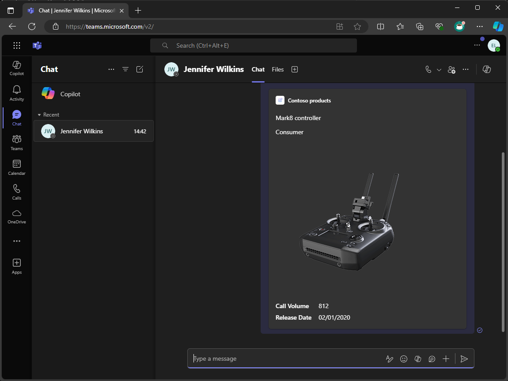

---
lab:
  title: Einführung
  module: 'LAB 01: Connect Copilot for Microsoft 365 to your external data in real-time with message extension plugins built with .NET and Visual Studio'
---

# Einführung

Mithilfe von Messaging-Erweiterungen können Benutzerinnen und Benutzer mit externen Systemen aus Microsoft Teams und Microsoft Outlook arbeiten. Die Benutzer können Nachrichtenerweiterungen verwenden, um Daten aus diesen Systemen in Nachrichten und E-Mails nachzuschlagen, zu ändern und weiterzugeben, und zwar in Form einer formatierten Karte.

Angenommen, Sie haben eine benutzerdefinierte API, die Sie für den Zugriff auf Produktinformationen verwenden, die aktuell und für Ihre Organisation relevant sind. Sie möchten diese Informationen in Microsoft 365 suchen und freigeben. Sie möchten auch, dass Copilot für Microsoft 365 diese Informationen in seinen Antworten verwendet.

In diesem Modul erstellen Sie eine Messaging-Erweiterung. Ihre Messaging-Erweiterung verwendet einen Bot, um mit Microsoft Teams, Microsoft Outlook und Copilot für Microsoft 365 zu kommunizieren.

Es verwendet Microsoft Entra, um Benutzer zu authentifizieren, so dass es in deren Namen Daten aus der API zurückgeben kann.

Nachdem sich Benutzende authentifiziert haben, erhält Ihre Nachrichtenerweiterung Daten von der API und gibt Suchergebnisse zurück, die in Nachrichten und E-Mails als formatierte Karte eingebettet und dann weitergegeben werden können.

Es arbeitet mit Copilot für Microsoft 365 als Plugin zusammen, so dass es die Produktdaten im Namen des Benutzers abfragen und die zurückgegebenen Daten in seinen Antworten verwenden kann.

Am Ende dieses Moduls können Sie Messaging-Erweiterungen erstellen, die in C# geschrieben wurden (unter .NET ausgeführt). Sie kann in Microsoft Teams, Microsoft Outlook und Copilot für Microsoft 365 verwendet werden. Sie kann Daten hinter geschützten APIs abfragen und die Ergebnisse als umfangreich formatierte Karten zurückgeben.

## Voraussetzungen

- C#-Grundkenntnisse
- Bicep-Grundkenntnisse
- Authentifizierungs-Grundkenntnisse 
- Administratorzugriff auf einen Microsoft 365-Mandanten
- Zugriff auf ein Azure-Abonnement
- Der Zugriff auf Copilot für Microsoft 365 ist optional und nur erforderlich, um **Übung 4: Aufgabe 5** abzuschließen.
- Visual Studio 2022 17.10 installiert mit [Teams Toolkit](/microsoftteams/platform/toolkit/toolkit-v4/teams-toolkit-fundamentals-vs) (Microsoft Teams-Entwicklungstools-Komponente)
- [.NET 8.0](https://dotnet.microsoft.com/download/dotnet/8.0)
- [Dev Proxy 0.19.1+](https://aka.ms/devproxy)

> [!NOTE]
> Die einzige Übung in diesem Labor, die eine Microsoft 365 Copilot-Lizenz erfordert, ist **Übung 4: Aufgabe 5**. Bis zu diesem Punkt sollte alles getan werden, ob Ihr Mandant Copilot hat oder nicht.

## Übungsdauer

  - **Geschätzter Zeitaufwand**: 150 Minuten

## Lernziele

Nach Abschluss dieses Moduls sollten Sie folgende Aufgaben ausführen können:

- Verstehen, was Nachrichtenerweiterungen sind und wie sie erstellt werden.
- Erstellen einer Nachrichtenerweiterung.
- Verstehen, wie man Benutzende mit Single Sign-on authentifiziert und eine benutzerdefinierte API aufruft, die durch die Microsoft Entra-Authentifizierung geschützt ist.
- Verstehen, wie Sie Nachrichtenerweiterungen für die Verwendung mit Copilot für Microsoft 365 erweitern und optimieren können.

Wenn Sie bereit sind zu beginnen, [fahren Sie mit der ersten Übung fort...](./2-exercise-create-a-message-extension.md)
