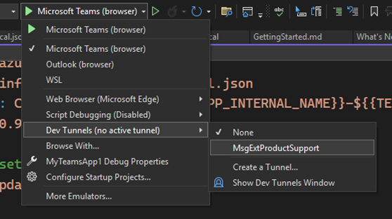
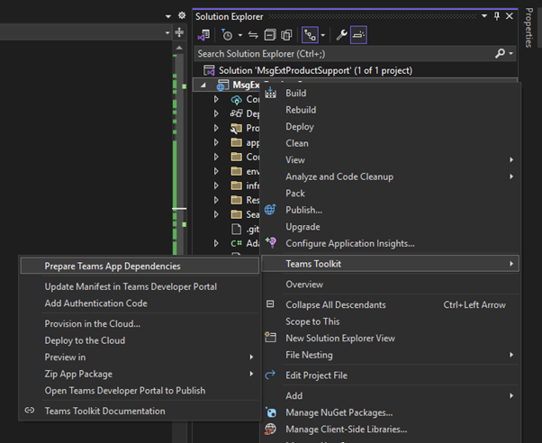

---
lab:
  title: Übung 1 - Eine Messaging-Erweiterung erstellen
  module: 'LAB 03: Connect Copilot for Microsoft 365 to your external data in real-time with message extension plugins built with .NET and Visual Studio'
---

# Übung 1 - Eine Messaging-Erweiterung erstellen

In dieser Übung erstellen Sie eine Messaging-Erweiterung mit einem Suchbefehl. Sie erstellen zunächst ein Projekt mit einer Teams Toolkit-Projektvorlage und aktualisieren es dann, um die Verwendung einer Azure KI Bot Service-Ressource für die lokale Entwicklung zu konfigurieren. Sie erstellen einen Dev-Tunnel, um die Kommunikation zwischen dem Bot-Dienst und Ihrem lokal ausgeführten Webdienst zu ermöglichen. Anschließend bereiten Sie Ihre App auf die Bereitstellung der erforderlichen Ressourcen vor. Schließlich führen Sie Ihre Messaging-Erweiterung aus und testen sie in Microsoft Teams.


## Aufgabe 1 - Erstellen eines neuen Projekts mit Teams Toolkit für Visual Studio

Beginnen Sie, indem Sie ein neues Projekt erstellen.

1. Öffnen Sie **Visual Studio 2022**
1. Öffnen Sie das Menü **Datei** und erweitern Sie das Menü **Neu**, wählen Sie **Neues Projekt**
1. Erweitern Sie im Bildschirm Neues Projekt erstellen das Dropdown-Menü **Alle Plattformen** und wählen Sie dann **Microsoft Teams**. Klicken Sie auf **Weiter**, um fortzufahren.
1. Auf dem Bildschirm Konfigurieren Sie Ihr neues Projekt. Füllen Sie die folgenden Werte aus:
    1. **Projektname**: MsgExtProductSupport
    1. **Speicherort**: Wählen Sie den Standardspeicherort aus.
1. Wählen Sie **Erstellen**, um ein Gerüst für das Projekt zu erstellen
1. Erweitern Sie im Dialogfeld Neue Teams-Anwendung erstellen das Dropdown-Menü **Alle Anwendungstypen** und wählen Sie dann **Messaging-Erweiterung**.
1. Wählen Sie in der Liste der Vorlagen **Benutzerdefinierte Suchergebnisse**
1. Erstellen Sie das Gerüst der App durch Auswahl von **Erstellen**

## Aufgabe 2 - Konfigurieren des Azure KI Bot Service

Eine Bot-Service-Ressource kann in Azure als Ressource oder über dev.botframework.com erstellt werden. Standardmäßig registriert die Vorlage für benutzerdefinierte Suchergebnisse einen Bot unter dev.botframework.com. Im Moment ist die Registrierung des Bots unter dev.botframework.com nicht mit Copilot für Microsoft 365 kompatibel.

Um Copilot für Microsoft 365 zu unterstützen, aktualisieren Sie das Projekt, um eine Azure KI Bot Service-Ressource in Azure bereitzustellen und sie für die lokale Entwicklung zu verwenden.

Zunächst erstellen wir eine Umgebungsvariable, um einen internen Namen für die Anwendung zu zentralisieren, den wir in allen unseren Dateien wiederverwenden und bei der Bereitstellung von Ressourcen verwenden können.

In Visual Studio:

1. Öffnen Sie im Ordner **env** die Datei **.env.local**
1. Fügen Sie in der Datei  den folgenden Code hinzu:

    ```text
    APP_INTERNAL_NAME=msgext-product-support
    ```

1. Speichern Sie Ihre Änderungen.

Sie verwenden Datenbindungsausdrücke, z. B. `${{APP_INTERNAL_NAME}}`, mit denen Sie Werte für Umgebungsvariablen in Dateien einfügen können, wenn Sie Teams Toolkit zur Bereitstellung von Ressourcen verwenden.

Um eine Azure AI Bot Service-Ressource bereitzustellen, ist eine Microsoft Entra App-Registrierung erforderlich. Erstellen Sie eine Manifestdatei für die App-Registrierung, die Teams Toolkit zur Bereitstellung der App-Registrierung verwendet.

Fortfahren in Visual Studio:

1. Erstellen Sie im Ordner **infra** einen neuen Ordner namens **entra**
1. Erstellen Sie in diesem Ordner eine Datei mit dem Namen **entra.bot.manifest.json**
1. Fügen Sie in der Datei  den folgenden Code hinzu:

    ```json
    {
      "id": "${{BOT_ENTRA_APP_OBJECT_ID}}",
      "appId": "${{BOT_ID}}",
      "name": "${{APP_INTERNAL_NAME}}-bot-${{TEAMSFX_ENV}}",
      "accessTokenAcceptedVersion": 2,
      "signInAudience": "AzureADMultipleOrgs",
      "optionalClaims": {
        "idToken": [],
        "accessToken": [
          {
            "name": "idtyp",
            "source": null,
            "essential": false,
            "additionalProperties": []
          }
        ],
        "saml2Token": []
      },
      "requiredResourceAccess": [],
      "oauth2Permissions": [],
      "preAuthorizedApplications": [],
      "identifierUris": [],
      "replyUrlsWithType": []
    }
    ```

1. Speichern Sie die Änderungen.

Teams Toolkit verwendet Bicep-Dateien zur Bereitstellung und Konfiguration von Ressourcen in Azure. Erstellen Sie zunächst eine Parameterdatei. Die Parameterdatei wird verwendet, um Umgebungsvariablen an eine Bicep-Vorlage zu übergeben.

Fortfahren in Visual Studio:

1. Erstellen Sie im Ordner **infra** eine neue Datei namens **azure.parameters.local.json**
1. Fügen Sie in der Datei  den folgenden Code hinzu:

    ```json
    {
      "$schema": "https://schema.management.azure.com/schemas/2015-01-01/deploymentParameters.json#",
      "contentVersion": "1.0.0.0",
      "parameters": {
        "resourceBaseName": {
          "value": "bot-${{RESOURCE_SUFFIX}}-${{TEAMSFX_ENV}}"
        },
        "botEntraAppClientId": {
          "value": "${{BOT_ID}}"
        },
        "botDisplayName": {
          "value": "${{APP_DISPLAY_NAME}}"
        },
        "botAppDomain": {
          "value": "${{BOT_DOMAIN}}"
        }
      }
    }
    ```

1. Speichern Sie die Änderungen.

Erstellen Sie nun eine Bicep-Datei, die mit der Parameterdatei verwendet wird.

1. Erstellen Sie im Ordner **infra** eine neue Datei namens **azure.local.bicep**
1. Fügen Sie in der Datei  den folgenden Code hinzu:

    ```bicep
    @maxLength(20)
    @minLength(4)
    @description('Used to generate names for all resources in this file')
    param resourceBaseName string
    
    @description('Required when create Azure Bot service')
    param botEntraAppClientId string
    @maxLength(42)
    param botDisplayName string
    param botAppDomain string
    
    module azureBotRegistration './botRegistration/azurebot.bicep' = {
      name: 'Azure-Bot-registration'
      params: {
        resourceBaseName: resourceBaseName
        botAadAppClientId: botEntraAppClientId
        botAppDomain: botAppDomain
        botDisplayName: botDisplayName
      }
    }
    ```

1. Speichern Sie die Änderungen.

Der letzte Schritt besteht darin, die Teams Toolkit-Projektdatei zu aktualisieren. Ersetzen Sie die Schritte, die Bot Framework-Aktionen verwenden, um den Bot Registrierung der Microsoft Entra-App mithilfe der Manifestdatei und der Azure KI Bot Service-Ressource mithilfe der Bicep-Datei bereitzustellen.

Fortsetzen in Visual Studio:

1. Öffnen Sie im Projektstammordner **teamsapp.local.yml**
1. Suchen Sie in der Datei den Schritt, der die Aktion **botAadApp/create** verwendet (Zeilen 17–26) und ersetzen Sie ihn durch:

    ```yml
      - uses: aadApp/create
        with:
          name: ${{APP_INTERNAL_NAME}}-bot-${{TEAMSFX_ENV}}
          generateClientSecret: true
          signInAudience: AzureADMultipleOrgs
        writeToEnvironmentFile:
          clientId: BOT_ID
          clientSecret: SECRET_BOT_PASSWORD
          objectId: BOT_ENTRA_APP_OBJECT_ID
          tenantId: BOT_ENTRA_APP_TENANT_ID
          authority: BOT_ENTRA_APP_OAUTH_AUTHORITY
          authorityHost: BOT_ENTRA_APP_OAUTH_AUTHORITY_HOST
    
      - uses: aadApp/update
        with:
          manifestPath: "./infra/entra/entra.bot.manifest.json"
          outputFilePath : "./build/entra.bot.manifest.${{TEAMSFX_ENV}}.json"
    
      - uses: arm/deploy
        with:
          subscriptionId: ${{AZURE_SUBSCRIPTION_ID}}
          resourceGroupName: ${{AZURE_RESOURCE_GROUP_NAME}}
          templates:
            - path: ./infra/azure.local.bicep
              parameters: ./infra/azure.parameters.local.json
              deploymentName: Create-resources-for-${{APP_INTERNAL_NAME}}-${{TEAMSFX_ENV}}
          bicepCliVersion: v0.9.1
    ```

1. Entfernen Sie in der Datei den Schritt, der die Aktion **botFramework/create** verwendet (Zeilen 53–62).
1. Speichern Sie die Änderungen.

Die App-Registrierung wird in zwei Schritten bereitgestellt. Zuerst erstellt die **aadApp/create**-Aktion eine neue mehrinstanzenfähige App-Registrierung mit einem geheimen Clientschlüssel und schreibt seine Ausgaben als Umgebungsvariablen in die Datei **.env.local**. Anschließend verwendet die **aadApp/update**-Aktion die **entra.bot.manifest.json**-Datei, um die App-Registrierung zu aktualisieren.

Im letzten Schritt wird die **arm/deploy**-Aktion verwendet, um die Azure KI Bot Service-Ressource mithilfe der ** azure.parameters.local.jsonder **-Datei und der **azure.local.bicep**-Datei  für die Ressourcengruppe bereitzustellen.

## Aufgabe 3 – Erstellen eines Dev-Tunnels

Wenn der Benutzer mit Ihrer Nachrichtenerweiterung interagiert, sendet der Botdienst Anforderungen an den Webdienst. Während der Entwicklung wird der Webdienst lokal auf Ihrem Computer ausgeführt. Damit der Botdienst Ihren Webdienst erreichen kann, müssen Sie ihn über Ihren Computer über einen Dev-Tunnel hinaus verfügbar machen.



Fortsetzen in Visual Studio:

1. Vergewissern Sie sich in der Symbolleiste, dass **MsgExtProductSupport** als Startprojekt ausgewählt ist und erweitern Sie das Menü „Debugprofil“, indem Sie das Dropdown-Menü neben der Schaltfläche **Microsoft Teams (Browser)** oder **Projekt starten** auswählen.
1. Erweitern Sie das Menü **Dev Tunnels (kein aktiver Tunnel)** und wählen Sie  **Tunnel erstellen...** aus.
1. Geben Sie im Dialogfeld die folgenden Werte an:
    1. **Konto**: Melden Sie sich mit Ihrem Microsoft 365-Benutzerkonto an.
    1. **Name**: MsgExtProductSupport
    1. **Tunneltyp**: Temporär
    1. **Zugriff**: Öffentlich
1. Erstellen Sie den Tunnel, indem Sie **OK** wählen.
1. Schließen Sie die Eingabeaufforderung, indem Sie **OK** auswählen.

## Aufgabe 4 – Aktualisieren des App-Manifests

Das App-Manifest beschreibt die Features und Funktionen der App. Aktualisieren Sie die Eigenschaften im App-Manifest zur besseren Beschreibung der Funktionen der App und der zugehörigen Features.

Laden Sie zunächst die App-Symbole herunter, und fügen Sie sie dem Projekt hinzu.


1. Laden Sie die **color-local.png** und **color-dev.png** herunter.
1. Fügen Sie im Ordner **appPackage** **color-local.png** und **color-dev.png** hinzu.
1. Löschen Sie im Ordner die Datei mit dem Namen **color.png**.

Wenn der App-Name an verschiedenen Stellen im Projekt repliziert wird, erstellen Sie eine neue Umgebungsvariable, um diesen Wert zentral zu speichern.

Fortsetzen in Visual Studio:

1. Öffnen Sie im Ordner **env** die Datei mit dem Namen **.env.local**.
1. Fügen Sie in der Datei  den folgenden Code hinzu:

    ```text
    APP_DISPLAY_NAME=Contoso products
    ```

1. Speichern Sie Ihre Änderungen.

Aktualisieren Sie zum Schluss die Symbole, den Namen und die Beschreibungsobjekte in der App-Manifestdatei.

1. Öffnen Sie im Ordner **appPackage** die Datei mit dem Namen **manifest.json**.
1. Ersetzen Sie in der Datei die Objekte **Symbole**, **Name** und **Beschreibung** durch die folgenden (Zeilen 13–24):

    ```json
        "icons": {
            "color": "color-${{TEAMSFX_ENV}}.png",
            "outline": "outline.png"
        },
        "name": {
            "short": "${{APP_DISPLAY_NAME}}",
            "full": "${{APP_DISPLAY_NAME}}"
        },
        "description": {
            "short": "Product look up tool.",
            "full": "Get real-time product information and share them in a conversation."
        },
    ```

1. Speichern Sie Ihre Änderungen.

## Aufgabe 3 – Bereitstellen der Ressourcen

Führen Sie jetzt mit dem Teams-Toolkit den Prozess "Teams-App-Abhängigkeiten vorbereiten" aus, um die erforderlichen Ressourcen bereitzustellen.



Die Vorbereitung von Teams-App-Abhängigkeiten aktualisiert die **BOT_ENDPOINT** - und **BOT_DOMAIN** -Umgebungsvariablen in der env.local-Datei mithilfe der aktiven Dev-Tunnel-URL und führt die in der **teamsapp.local.yml**-Datei beschriebenen Aktionen aus.

Fortsetzen in Visual Studio:

1. Klicken Sie im Projektmappen-Explorer mit der rechten Maustaste auf **TeamsApp**.
1. Erweitern Sie das Menü **Teams Toolkit**, wählen Sie **Teams App-Abhängigkeiten vorbereiten**
1. Wählen Sie im Dialogfeld **Microsoft 365-Konto** das Konto für Ihren Entwickler-Mandanten aus und wählen Sie dann **Fortfahren**.
1. Wählen Sie im Dialogfeld **Bereitstellung** das Konto aus, das für die Bereitstellung von Ressourcen in Azure verwendet werden soll, und geben Sie die folgenden Werte an:
    1. **Abonnementname**: Verwenden Sie die Dropdown-Liste, um ein Abonnement auszuwählen.
    1. **Ressourcengruppe**: Erweitern Sie das Dropdown-Menü, und wählen Sie die Ressourcengruppe aus, die für Ihr Benutzerkonto bereits erstellt wurde.
    1. **Region**: Verwenden Sie das Dropdown-Menü, um die Region auszuwählen, die Ihnen am nächsten liegt
1. Bereitstellen der Ressourcen in Azure durch Auswählen von **Bereitstellung**
1. Wählen Sie in der Warnmeldung des Teams Toolkit die Option **Provision**
1. Wählen Sie in der Informationsaufforderung des Teams Toolkit die Option **Bereitgestellte Ressourcen anzeigen**, um ein neues Browserfenster zu öffnen.

Nehmen Sie sich einen Moment Zeit, um die in Azure erstellten Ressourcen zu erkunden.

## Aufgabe 7 - Ausführen und Debuggen  

Starten Sie nun den Webdienst, und testen Sie die Messaging-Erweiterung. Sie verwenden Teams Toolkit, um Ihr App-Manifest hochzuladen und Ihre Messaging-Erweiterung in Microsoft Teams zu testen.

Fortsetzen in Visual Studio:

1. Drücken Sie F5, um eine Debugging-Sitzung zu starten und ein neues Browser-Fenster zu öffnen, das den Microsoft Teams-Web-Client navigiert.
1. Wählen Sie **Ja**, wenn Sie gefragt werden, ob Sie den verschiedenen SSL-Zertifikaten vertrauen wollen, und wählen Sie dann erneut **Ja** bei Sicherheitswarnungen. Beachten Sie, dass Sie den Debugger möglicherweise neu starten müssen, nachdem Sie die Zertifikate akzeptiert haben.
1. Wenn Sie dazu aufgefordert werden, geben Sie die Anmeldeinformationen für Ihr Microsoft 365-Konto ein.

  > [!IMPORTANT]
  > Wenn in Microsoft Teams ein Dialogfeld mit der Meldung „Diese App wurde nicht gefunden“ angezeigt wird, führen Sie die folgenden Schritte aus, um das App-Paket manuell hochzuladen:
  >
  >  1. Schließen Sie das Dialogfeld
  >  2. Gehen Sie in der Randleiste auf **Apps**
  >  3. Wählen Sie im linken Menü **Verwalten Ihrer Apps**aus
  >  4. Wählen Sie auf der Befehlsleiste **Datei hochladen** aus
  >  5. Wählen Sie im Dialogfeld **Eine angepasste App hochladen**aus
  >  6. Navigieren Sie im Datei-Explorer zum Lösungsordner, öffnen Sie den Ordner **appPackage\build** und wählen Sie **appPackage.local.zip**, dann **Hinzufügen**

Fahren Sie mit der Installation der App fort:.

1. Wählen Sie im Installationsdialog der App **Hinzufügen**aus
1. Öffnen Sie einen neuen oder bestehenden Microsoft Teams-Chat
1. Beginnen Sie im Bereich zum Verfassen von Nachrichten mit der Eingabe von **/apps**, um das Flyout zu öffnen.
1. Wählen Sie in der Liste der Apps **Contoso-Produkte**, um die Messaging-Erweiterung zu öffnen
1. Geben Sie in das Textfeld **Bot Builder** ein, um eine Suche zu starten
1. Wählen Sie in der Ergebnisliste ein Ergebnis aus, um eine Karte in das Feld Nachricht verfassen einzubetten

Schließen Sie den Browser, um die Debugging-Sitzung zu beenden.

[Fahren Sie mit der nächsten Übung fort...](./3-exercise-add-single-sign-on.md)