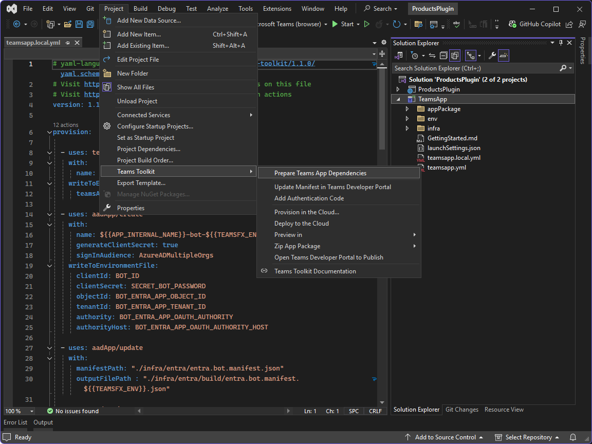

---
lab:
  title: Übung 1 - Eine Messaging-Erweiterung erstellen
  module: 'LAB 01: Connect Microsoft 365 Copilot to your external data in real-time with message extension plugins built with .NET and Visual Studio'
---

# Übung 1 - Eine Messaging-Erweiterung erstellen

In dieser Übung erstellen Sie eine Lösung für die Nachrichtenerweiterung. Sie verwenden das Teams-Toolkit in Visual Studio, um die erforderlichen Ressourcen zu erstellen und dann eine Debugsitzung zu starten und in Microsoft Teams zu testen.


### Übungsdauer

  - **Geschätzter Zeitaufwand**: 25 Minuten

## Aufgabe 1 - Erstellen eines neuen Projekts mit Teams Toolkit für Visual Studio

Erstellen Sie zunächst ein neues Microsoft Teams-App-Projekt, das mit einer Nachrichtenerweiterung konfiguriert ist, die einen Suchbefehl enthält. Sie können zwar ein Projekt mit einer Teams Toolkit for Visual Studio-Projektvorlage erstellen, aber es sind Änderungen am Projektgerüst erforderlich, um dieses Modul abschließen zu können. Stattdessen verwenden Sie eine benutzerdefinierte Projektvorlage, die als NuGet-Paket verfügbar ist. Der Vorteil der Verwendung einer benutzerdefinierten Vorlage besteht darin, dass sie eine Lösung mit den erforderlichen Dateien und Abhängigkeiten erstellt und Ihnen Zeit spart.

1. Öffnen Sie als Administrator eine neue PowerShell-Sitzung.

1. Wechseln Sie zu einem geeigneten Arbeitsverzeichnis, indem Sie Folgendes ausführen:

    ```Powershell
    cd ~\Documents
    ```

1. Beginnen Sie mit der Installation des Vorlagenpakets aus NuGet, indem Sie Folgendes ausführen:

    ```PowerShell
    dotnet new install M365Advocacy.Teams.Templates
    ```

1. Erstellen Sie ein neues Projekt, indem Sie ausführen:

    ```PowerShell
    dotnet new teams-msgext-search --name "ProductsPlugin" `
      --internal-name "msgext-products" `
      --display-name "Contoso products" `
      --short-description "Product look up tool." `
      --full-description "Get real-time product information and share them in a conversation." `
      --command-id "Search" `
      --command-description "Find products by name" `
      --command-title "Products" `
      --parameter-name "ProductName" `
      --parameter-title "Product name" `
      --parameter-description "The name of the product as a keyword" `
      --allow-scripts Yes
    ```

1. Warten Sie, bis Ihr Projekt erstellt wurde.

1. Wechseln Sie in das Projektverzeichnis, indem Sie `cd ProductsPlugin` ausführen.

1. Öffnen Sie die Lösung in Visual Studio, indem Sie `.\ProductsPlugin.sln` ausführen.

1. Wählen Sie **Visual Studio 2022** im Anwendungsauswahlfenster und dann **Immer** aus.

## Aufgabe 2 – Erstellen eines Dev-Tunnels

Wenn der Benutzer mit Ihrer Nachrichtenerweiterung interagiert, sendet der Botdienst Anforderungen an den Webdienst. Während der Entwicklung wird der Webdienst lokal auf Ihrem Computer ausgeführt. Damit der Botdienst Ihren Webdienst erreichen kann, müssen Sie ihn über Ihren Computer über einen Dev-Tunnel hinaus verfügbar machen.


Fortsetzen in Visual Studio:

1. Wählen Sie in der Werkzeugleiste das Dropdown-Menü neben der Schaltfläche **Start**, erweitern Sie das Menü **Dev Tunnels (no active tunnel)** und wählen Sie **Create a Tunnel**.

1. Geben Sie im Dialogfeld die folgenden Werte an:

    1. **Konto**: Melden Sie sich mit dem Ihnen bereitgestellten Microsoft 365-Konto an. Wählen Sie **Geschäfts- oder Schulkonto hinzufügen** aus.

    1. **Name**: msgext-Produkte

    1. **Tunneltyp**: Temporär

    1. **Zugriff**: Öffentlich

1. Erstellen Sie den Tunnel, indem Sie **OK** wählen. Es wird eine Eingabeaufforderung angezeigt, die besagt, dass der neue Tunnel nun der aktuelle aktive Tunnel ist.

1. Schließen Sie die Eingabeaufforderung, indem Sie **OK** auswählen.

## Aufgabe 3 – Vorbereiten von Ressourcen

Wenn nun alles vorhanden ist, führen Sie mit Teams Toolkit den Prozess **Prepare Teams App Dependencies** aus, um die erforderlichen Ressourcen zu erstellen.



Der Vorbereitungsprozess für Teams App-Abhängigkeiten aktualisiert die **BOT_ENDPOINT** und **BOT_DOMAIN** Umgebungsvariablen in der Datei **TeamsApp\\env\\.env.local** unter Verwendung der aktiven Dev-Tunnel-URL und führt die in der Datei **TeamsApp\\teamsapp.local.yml** beschriebenen Aktionen aus.

Nehmen Sie sich einen Moment Zeit, um die Schritte in der **datei teamsapp.local.yml** zu erkunden.

Fortsetzen in Visual Studio:

1. Öffnen Sie das Menü **Projekt** (alternativ können Sie das Projekt **TeamsApp** im Projektmappen-Explorer mit der rechten Maustaste auswählen), erweitern Sie das Menü **Teams Toolkit** und wählen Sie **Teams App-Abhängigkeiten vorbereiten**.

1. Melden Sie sich im Dialogfeld **Microsoft 365-Konto** an oder wählen Sie ein vorhandenes Konto aus, um auf Ihren Microsoft 365-Mandanten zuzugreifen, und wählen Sie dann **Fortfahren** aus.

1. Melden Sie sich im Dialog **Bereitstellung** an oder wählen Sie ein vorhandenes Konto aus, das für die Bereitstellung von Ressourcen in Azure verwendet werden soll, und geben Sie die folgenden Werte an:

      1. **Abonnementname**: Verwenden Sie die Dropdown-Liste, um ein Abonnement auszuwählen

      1. **Ressourcengruppe**: Wählen Sie die vorausgefüllte Ressourcengruppe aus der Dropdown-Liste.

1. Bereitstellen der Ressourcen in Azure durch Auswählen von **Bereitstellung**.

1. Wählen Sie in der Warnmeldung des Teams Toolkit die Option **Bereitstellung** aus.

1. Wählen Sie in der Informationsaufforderung des Teams Toolkit die Option **Bereitgestellte Ressourcen anzeigen**, um ein neues Browserfenster zu öffnen.

Nehmen Sie sich einen Moment Zeit, um die in Azure erstellten Ressourcen zu untersuchen und die in der Datei **.env.local** erstellten Umgebungsvariablen zu betrachten.

> [!NOTE]
> Wenn Sie Visual Studio schließen und erneut öffnen, ändert sich die Dev-Tunnel-URL und wird nicht mehr als aktiver Tunnel ausgewählt. In diesem Fall müssen Sie den Tunnel erneut auswählen und den Prozess **Prepare Teams App Dependencies** ausführen, um die aktualisierte URL im App-Manifest zu berücksichtigen.

## Aufgabe 4 – Ausführen und Debuggen

Das Teams-Toolkit verwendet Multiprojektstartprofile. Zum Ausführen des Projekts müssen Sie eine Vorschaufunktion in Visual Studio aktivieren.

In Visual Studio:

1. Klicken Sie im Menü **Werkzeuge** auf **Optionen...**.

1. Geben Sie im Suchfeld das Wort **Multiprojekt** ein.

1. Wählen Sie unter **Umgebung** die Option **Funktionsvorschau** aus.

1. Aktivieren Sie das Kontrollkästchen neben **Multiprojekt-Startprofile aktivieren** und wählen Sie **OK**, um Ihre Änderungen zu speichern.

So starten Sie eine Debugsitzung, und installieren die App in Microsoft Teams:

1. Drücken Sie <kbd>F5</kbd> oder wählen Sie **Start** in der Werkzeugleiste.

1. Vertrauen oder genehmigen Sie alle SSL-Zertifizierungswarnungen, die beim erstmaligen Starten der App angezeigt werden.

1. Warten Sie, bis sich ein Browser-Fenster öffnet und der Dialog zur Installation der App im Microsoft Teams-Webclient angezeigt wird. Wenn Sie dazu aufgefordert werden, geben Sie die Anmeldeinformationen für Ihr Microsoft 365-Konto an.

1. Wählen Sie im Installationsdialog der App **Hinzufügen** aus.

So testen Sie die Nachrichtenerweiterung

1. Öffnen Sie einen neuen Chat (<kbd>Alt+N</kbd>) und geben Sie **Contoso** in das Feld **An** ein und wählen Sie **Contoso Product Support**.

    > [!NOTE]
    > Es funktioniert nicht, wenn Sie mit Ihrem eigenen Benutzerkonto chatten. Er muss ein anderer Benutzer oder eine andere Gruppe sein.

1. Beginnen Sie im Bereich zum Verfassen von Nachrichten mit der Eingabe von **/apps**, um die App-Auswahl zu öffnen.

1. Wählen Sie in der Liste der Apps **Contoso-Produkte** aus, um die Messaging-Erweiterung zu öffnen.

1. Geben Sie in das Textfeld **Hallo** ein. Möglicherweise müssen Sie Ihre Suche mehrmals eingeben.

1. Warten Sie, bis die Suchergebnisse angezeigt werden.

1. Wählen Sie in der Ergebnisliste **Hallo**, um eine Karte in das Feld zum Verfassen einer Nachricht einzubetten.


Kehren Sie zu Visual Studio zurück und wählen Sie **Anhalten** in der Symbolleiste aus oder drücken Sie <kbd>Umschalt</kbd> + <kbd>F5</kbd>, um die Debug-Sitzung zu beenden.

[Fahren Sie mit der nächsten Übung fort...](./3-exercise-add-single-sign-on.md)