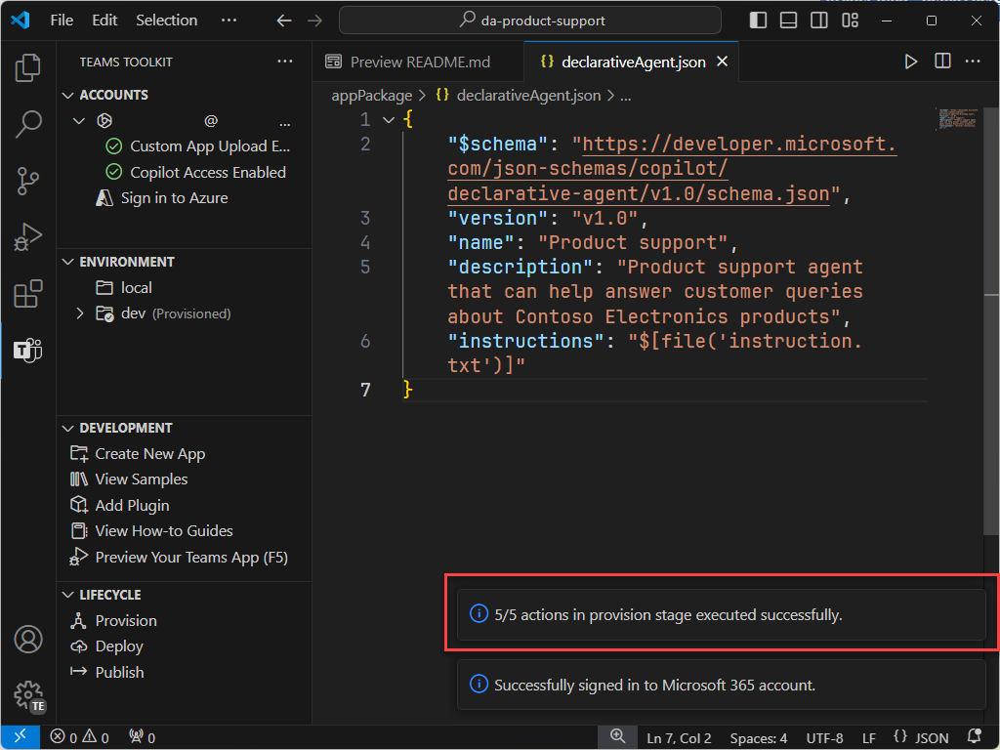

---
lab:
  title: Übung 1 – Erstellen eines deklarativen Agenten in Visual Studio Code
  module: 'LAB 01: Build a declarative agent for Microsoft 365 Copilot using Visual Studio Code'
---

# Übung 1 – Erstellen eines deklarativen Agents

In dieser Übung erstellen Sie ein deklaratives Agent-Projekt aus einer Vorlage, aktualisieren das Manifest, laden den Agent in Microsoft 365 hoch und testen den Agent in Microsoft 365 Copilot. 

Ein deklarativer Agent wird in einer Microsoft 365-App implementiert. Sie erstellen ein App-Paket, das Folgendes enthält:

- app.manifest.json: Die App-Manifestdatei beschreibt, wie Ihre App konfiguriert ist, einschließlich ihrer Funktionen.
- declarative-agent.json: Das deklarative Agent-Manifest beschreibt, wie Ihr deklarativer Agent konfiguriert ist.
- color.png und outline.png: Ein Farb- und Gliederungssymbol, das verwendet wird, um Ihren deklarativen Agent auf der Microsoft 365 Copilot-Benutzeroberfläche darzustellen.

### Übungsdauer

- **Geschätzter Zeitaufwand**: 15 Minuten

## Aufgabe 1: Aktivieren von benutzerdefinierten App-Uploads in Teams Admin Center

Um deklarative Agents über das Teams-Toolkit in Microsoft 365 hochzuladen, müssen Sie **Benutzerdefinierte App-Uploads** im Teams Admin Center aktivieren.

1. Navigieren Sie zu Teams-Apps > App-Einrichtungsrichtlinien im Teams-Administrationszentrum oder gehen Sie direkt zu [App-Einrichtungsrichtlinien](https://admin.teams.microsoft.com/policies/app-setup).
1. Wählen Sie **Global (Org-weiter Standard)** aus der Liste der Richtlinien.
1. Aktivieren Sie **Benutzerdefinierte Anwendungen hochladen**.
1. Wählen Sie **Speichern** und dann **Bestätigen** Sie Ihre Wahl.

## Aufgabe 2 :Herunterladen des Startprojekts

Laden Sie zunächst das Beispielprojekt von GitHub in einem Webbrowser herunter:

1. Navigieren Sie zum Vorlagen-Repository [https://github.com/microsoft/learn-declarative-agent-vscode](https://github.com/microsoft/learn-declarative-agent-vscode).
    1. Führen Sie die Schritte aus, um [den Quellcode des Repositorys](https://docs.github.com/repositories/working-with-files/using-files/downloading-source-code-archives#downloading-source-code-archives-from-the-repository-view) auf Ihren Computer herunterzuladen.
    1. Extrahieren Sie den Inhalt der heruntergeladenen ZIP-Datei, und erweitern Sie ihn in Ihren **Dokumentenordner**.

Das Startprojekt enthält ein Teams Toolkit-Projekt, das einen deklarativen Agent enthält.

1. Öffnen Sie den Projektordner  in Visual Studio Code.
1. Öffnen Sie im Stammordner des Projekts die Datei **README.md**. Überprüfen Sie den Inhalt, um weitere Informationen zur Projektstruktur zu erfahren.


## Aufgabe 3: Untersuchen des deklarativen Agenten-Manifests

Sehen wir uns die Manifestdatei des deklarativen Agents an:

- Öffnen Sie die Datei **appPackage/declarativeAgent.json** und untersuchen Sie den Inhalt:

    ```json
    {
        "$schema": "https://aka.ms/json-schemas/agent/declarative-agent/v1.0/schema.json",
        "version": "v1.0",
        "name": "da-product-support",
        "description": "Declarative agent created with Teams Toolkit",
        "instructions": "$[file('instruction.txt')]"
    }
    ```

Der Wert der Eigenschaft **Anweisungen** enthält einen Verweis auf eine Datei namens **instruction.txt**. Die Funktion **$[file(path)]** wird von Teams Toolkit bereitgestellt. Der Inhalt der Datei **instruction.txt** wird in die Manifestdatei des deklarativen Agents aufgenommen, wenn dieser für Microsoft 365 bereitgestellt wird.

- Öffnen Sie im Ordner **appPackage** die Datei **instruction.txt** und überprüfen Sie den Inhalt:

    ```md
    You are a declarative agent and were created with Team Toolkit. You should start every response and answer to the user with "Thanks for using Teams Toolkit to create your declarative agent!\n\n" and then answer the questions and help the user.
    ```

## Aufgabe 4: Aktualisieren des deklarativen Agenten-Manifests

Lassen Sie uns die Eigenschaften **Name** und **Beschreibung** aktualisieren, damit sie für unser Szenario besser geeignet sind.

1. Öffnen Sie im Ordner **appPackage** die Datei **declarativeAgent.json**.
1. Aktualisieren Sie den Wert der Eigenschaft **Name** auf **Microsoft 365 Knowledge Expert**.
1. Aktualisieren Sie den Wert der Eigenschaft **description** auf **Microsoft 365 Knowledge Expert, der alle Ihre Fragen zu Microsoft 365 beantworten kann**.
1. Speichern Sie Ihre Änderungen.

Die aktualisierte Datei sollte den folgenden Inhalt haben:

```json
{
    "$schema": "https://aka.ms/json-schemas/agent/declarative-agent/v1.0/schema.json",
    "version": "v1.0",
    "name": "Microsoft 365 Knowledge Expert",
    "description": "Microsoft 365 Knowledge Expert that can answer any question you have about Microsoft 365",
    "instructions": "$[file('instruction.txt')]"
}
```

## Aufgabe 5: Hochladen des deklarativen Agents in Microsoft 365

Laden Sie als Nächstes Ihren deklarativen Agent in Ihren Microsoft 365-Mandanten hoch.

In Visual Studio Code:

1. Öffnen Sie in der **Aktivitätsleiste** die Erweiterung **Teams Toolkit**.

    

1. Im Abschnitt **Lebenszyklus** wählen Sie **Bereitstellung**.

    

1. Wählen Sie in dem Prompt **Anmelden** und folgen Sie den Anweisungen, um sich mit Teams Toolkit bei Ihrem Microsoft 365 Mandanten anzumelden. Der Bereitstellungsprozess wird nach der Anmeldung automatisch gestartet.

    

    

1. Warten Sie, bis der Upload abgeschlossen wurde, bevor Sie fortfahren.

    

Überprüfen Sie als Nächstes die Ausgabe des Bereitstellungsprozesses.

- Öffnen Sie im Ordner **appPackage/build** die Datei **declarativeAgent.dev.json**.

Beachten Sie, dass der Wert der Eigenschaft **instructions** den Inhalt der Datei **instruction.txt** enthält. Die Datei **declarativeAgent.dev.json** befindet sich in der Datei **appPackage.dev.zip** zusammen mit den Dateien **manifest.dev.json**, **color.png** und **outline.png**. Die Datei **appPackage.dev.zip** wird in Microsoft 365 hochgeladen.

> [!IMPORTANT]
> Nach der Anmeldung bei Ihrem Microsoft 365-Konto werden möglicherweise die folgenden Warnungen oder Fehlermeldungen in Visual Studio Code angezeigt. Wenn Sie gerade benutzerdefinierte App-Uploads in Microsoft Teams aktiviert haben, kann es einige Zeit dauern, bis die Einstellung wirksam wird.  Warten Sie einige Minuten, und versuchen Sie es erneut, oder melden Sie sich ab, und melden Sie sich mit Ihrem Microsoft 365-Konto wieder an. Die zweite Meldung über den Microsoft 365 Copilot-Zugriff wird erwartet, da der Mandant nicht über eine vollständige Copilot-Lizenz verfügt.
> 
> 

## Aufgabe 6: Testen des deklarativen Agents in Microsoft 365 Copilot Chat

Als Nächstes führen wir den deklarativen Agent in Microsoft 365 Copilot Chat aus und überprüfen seine Funktionalität.

1. Öffnen Sie in der **Aktivitätsleiste** die Erweiterung **Teams Toolkit**.

    

1. Im Abschnitt **Lebenszyklus** wählen Sie **Veröffentlichen**. Warten Sie, bis die Aktionen abgeschlossen sind.

1. Öffnen Sie Microsoft Edge und suchen Sie den Microsoft 365 Copilot Chat unter [https://www.microsoft365.com/chat](https://www.microsoft365.com/chat).

1. Wählen Sie in **Microsoft 365 Copilot Chat** das Symbol oben rechts, um das Copilot-Bedienfeld zu erweitern. Beachten Sie, dass im Bereich zuletzt verwendete Chats und verfügbare Agents angezeigt werden.

1. Wählen Sie im seitlichen Bedienfeld **Microsoft 365 Knowledge Expert**, um das immersive Erlebnis zu betreten und direkt mit dem Agenten zu chatten.

1. Fragen Sie den Agent **Was bist du fähig zu tun?** und übermitteln Sie den Prompt.

    

Fahren Sie mit der nächsten Übung fort.