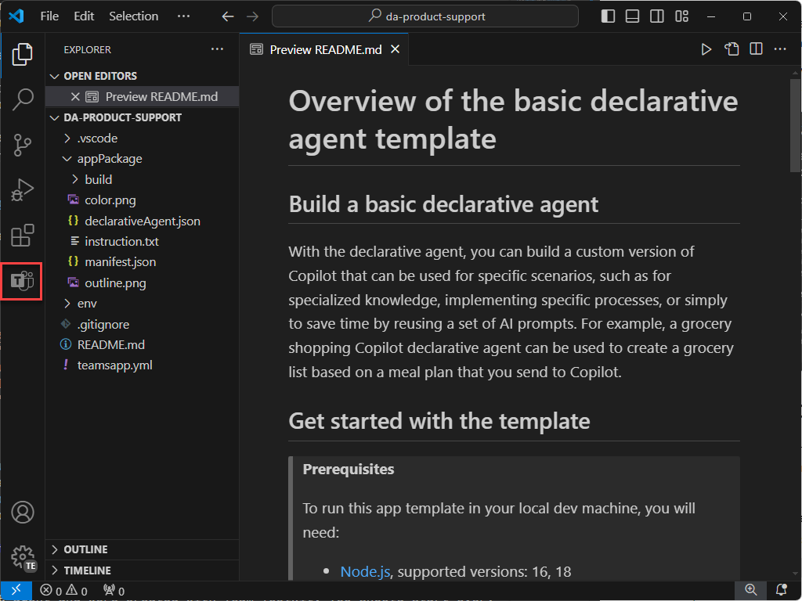
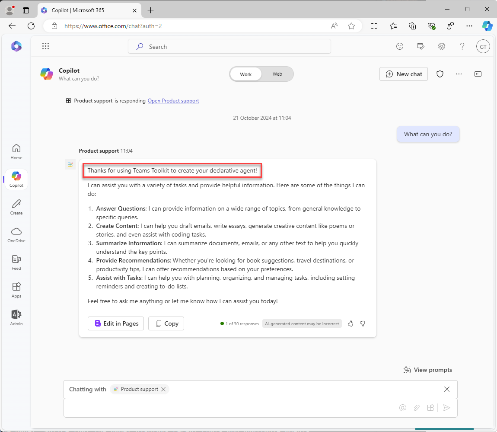

---
lab:
  title: Übung 1 – Erstellen eines deklarativen Agenten in Visual Studio Code
  module: 'LAB 01: Build a declarative agent for Microsoft 365 Copilot using Visual Studio Code'
---

# Übung 1 – Erstellen eines deklarativen Agents

In dieser Übung erstellen Sie ein deklaratives Agent-Projekt aus einer Vorlage, aktualisieren das Manifest, laden den Agent in Microsoft 365 hoch und testen den Agent in Microsoft 365 Copilot. 

Ein deklarativer Agent wird in einer Microsoft 365-App implementiert. Sie erstellen ein App-Paket, das Folgendes enthält:

- app.manifest.json: Die App-Manifestdatei beschreibt, wie Ihre App konfiguriert ist, einschließlich ihrer Funktionen.
- declarative-agent.json: Das deklarative Agent-Manifest beschreibt, wie Ihr deklarativer Agent konfiguriert ist.
- color.png und outline.png: Ein Farb- und Gliederungssymbol, das verwendet wird, um Ihren deklarativen Agent auf der Microsoft 365 Copilot-Benutzeroberfläche darzustellen.

### Übungsdauer

- **Geschätzter Zeitaufwand**: 15 Minuten

## Aufgabe 1 -- Herunterladen des Startprojekts

Laden Sie zunächst das Beispielprojekt von GitHub in einem Webbrowser herunter:

1. Navigieren Sie zum Vorlagen-Repository [https://github.com/microsoft/learn-declarative-agent-vscode](https://github.com/microsoft/learn-declarative-agent-vscode).
    1. Führen Sie die Schritte aus, um [den Quellcode des Repositorys](https://docs.github.com/repositories/working-with-files/using-files/downloading-source-code-archives#downloading-source-code-archives-from-the-repository-view) auf Ihren Computer herunterzuladen.
    1. Extrahieren Sie den Inhalt der heruntergeladenen ZIP-Datei, und erweitern Sie ihn in Ihren **Dokumentenordner**.

Das Startprojekt enthält ein Teams Toolkit-Projekt, das einen deklarativen Agent enthält.

1. Öffnen Sie den Projektordner  in Visual Studio Code.
1. Öffnen Sie im Stammordner des Projekts die Datei **README.md**. Überprüfen Sie den Inhalt, um weitere Informationen zur Projektstruktur zu erfahren.


## Aufgabe 2 – Untersuchen des deklarativen Agenten-Manifests

Sehen wir uns die Manifestdatei des deklarativen Agents an:

- Öffnen Sie die Datei **appPackage/declarativeAgent.json** und untersuchen Sie den Inhalt:

    ```json
    {
        "$schema": "https://aka.ms/json-schemas/agent/declarative-agent/v1.0/schema.json",
        "version": "v1.0",
        "name": "da-product-support",
        "description": "Declarative agent created with Teams Toolkit",
        "instructions": "$[file('instruction.txt')]"
    }
    ```

Der Wert der Eigenschaft **Anweisungen** enthält einen Verweis auf eine Datei namens **instruction.txt**. Die Funktion **$[file(path)]** wird von Teams Toolkit bereitgestellt. Der Inhalt der Datei **instruction.txt** wird in die Manifestdatei des deklarativen Agents aufgenommen, wenn dieser für Microsoft 365 bereitgestellt wird.

- Öffnen Sie im Ordner **appPackage** die Datei **instruction.txt** und überprüfen Sie den Inhalt:

    ```md
    You are a declarative agent and were created with Team Toolkit. You should start every response and answer to the user with "Thanks for using Teams Toolkit to create your declarative agent!\n\n" and then answer the questions and help the user.
    ```

## Aufgabe 3 – Aktualisieren des deklarativen Agenten-Manifests

Lassen Sie uns die Eigenschaften **Name** und **Beschreibung** aktualisieren, damit sie für unser Szenario besser geeignet sind.

1. Öffnen Sie im Ordner **appPackage** die Datei **declarativeAgent.json**.
1. Aktualisieren Sie den Wert der Eigenschaft **Name** auf **Produkt-Support**.
1. Aktualisieren Sie den Wert der Eigenschaft **Beschreibung** auf **Produkt-Support-Agents, die Kundenanfragen zu Contoso Electronics-Produkten beantworten können**.
1. Speichern Sie Ihre Änderungen.

Die aktualisierte Datei sollte den folgenden Inhalt haben:

```json
{
    "$schema": "https://aka.ms/json-schemas/agent/declarative-agent/v1.0/schema.json",
    "version": "v1.0",
    "name": "Product support",
    "description": "Product support agent that can help answer customer queries about Contoso Electronics products",
    "instructions": "$[file('instruction.txt')]"
}
```

## Aufgabe 4 – Laden Sie den deklarativen Agenten nach Microsoft 365 hoch

> [!IMPORTANT]
> Bevor Sie beginnen, stellen Sie sicher, dass die Teams Toolkit-Erweiterung in Visual Studio Code installiert ist. Wenn Sie die Erweiterung noch nicht vom Marketplace installiert haben, tun Sie dies jetzt.

Laden Sie als Nächstes Ihren deklarativen Agent in Ihren Microsoft 365-Mandanten hoch.

In Visual Studio Code:

1. Öffnen Sie in der **Aktivitätsleiste** die Erweiterung **Teams Toolkit**.

    

1. Im Abschnitt **Lebenszyklus** wählen Sie **Bereitstellung**.

    

1. Wählen Sie in dem Prompt **Anmelden** und folgen Sie den Anweisungen, um sich mit Teams Toolkit bei Ihrem Microsoft 365 Mandanten anzumelden. Der Bereitstellungsprozess wird nach der Anmeldung automatisch gestartet.

    

    

1. Warten Sie, bis der Upload abgeschlossen wurde, bevor Sie fortfahren.

    

Überprüfen Sie als Nächstes die Ausgabe des Bereitstellungsprozesses.

- Öffnen Sie im Ordner **appPackage/build** die Datei **declarativeAgent.dev.json**.

Beachten Sie, dass der Wert der Eigenschaft **instructions** den Inhalt der Datei **instruction.txt** enthält. Die Datei **declarativeAgent.dev.json** befindet sich in der Datei **appPackage.dev.zip** zusammen mit den Dateien **manifest.dev.json**, **color.png** und **outline.png**. Die Datei **appPackage.dev.zip** wird in Microsoft 365 hochgeladen.

## Aufgabe 5 – Testen des deklarativen Agenten in Microsoft 365 Copilot

Als Nächstes führen wir den deklarativen Agent in Microsoft 365 Copilot aus und überprüfen seine Funktionalität sowohl **im Kontext** als auch in **immersiven** Umgebungen.

In Visual Studio Code:

1. Wechseln Sie in der **Aktivitätsleiste** zur Ansicht **Ausführen und Debuggen**.

    

1. Wählen Sie die Schaltfläche **Debugging starten** neben dem Dropdown-Menü der Konfiguration, oder drücken Sie <kbd>F5</kbd>. Ein neues Browserfenster wird gestartet und navigiert zu Microsoft 365 Copilot.

    

    

    

Im Browser werden wir die Erfahrung **In-Kontext** testen.

1. Geben Sie in **Microsoft 365 Copilot** im Nachrichtenfeld das Symbol <kbd>@</kbd> ein. Das Flyout wird mit einer Liste der verfügbaren Agents angezeigt.

    

1. Wählen Sie im Flyout **Produktsupport** aus. Beachten Sie die Statusmeldung oberhalb des Nachrichtenfelds. Es zeigt **Mit Produktsupport chatten** an, was bedeutet, dass Sie die In-Context-Erfahrung des Agents verwenden.

    

1. Geben Sie im Textfeld **Was können Sie tun?**, und senden Sie Ihre Nachricht.

    

1. Warten Sie auf die Antwort. Beachten Sie, dass die Antwort mit dem Text „Vielen Dank, dass Sie Teams-Toolkit zur Erstellung Ihres deklarativen Agents verwenden!“ beginnt. wie in den Anweisungen definiert, die Sie zuvor überprüft haben.

    

1. Um die In-Kontext-Erfahrung zu beenden, wählen Sie das Kreuz (X) in der Statusmeldung aus. Beachten Sie, dass die Statusmeldung entfernt wird und im Chatfenster eine Meldung angezeigt wird, die darauf hinweist, dass Sie nicht mehr mit dem Agent chatten.

    

    

Lassen Sie uns schließlich die **immersive** Erfahrung testen.

Fortsetzen im Browser:

1. Wählen Sie in **Microsoft 365 Copilot** das Symbol oben rechts aus, um den Copilot-Seitenbereich zu erweitern. Beachten Sie, dass im Bereich zuletzt verwendete Chats und verfügbare Agents angezeigt werden.

    

1. Wählen Sie im seitlichen Bereich **Produktsupport** aus, um zur immersiven Erfahrung zu wechseln und direkt mit dem Agent zu chatten. Beachten Sie zwei Beispielaufforderungen, die in der Oberfläche angezeigt werden.

    

1. Wählen Sie den Beispiel-Prompt mit dem Titel **Weitere Informationen** aus. Beachten Sie, dass der Text **Was können Sie tun?** für Sie dem Nachrichtenfeld hinzugefügt wird.

    

1. Senden Sie die Nachricht, und warten Sie auf die Antwort. Beachten Sie, dass die Antwort mit dem Text „Vielen Dank, dass Sie Teams-Toolkit zur Erstellung Ihres deklarativen Agents verwenden!“ beginnt. wie in den Anweisungen definiert, die Sie zuvor überprüft haben.

    

Schließen Sie schließlich den Browser, um die Debugsitzung in Visual Studio Code zu beenden.