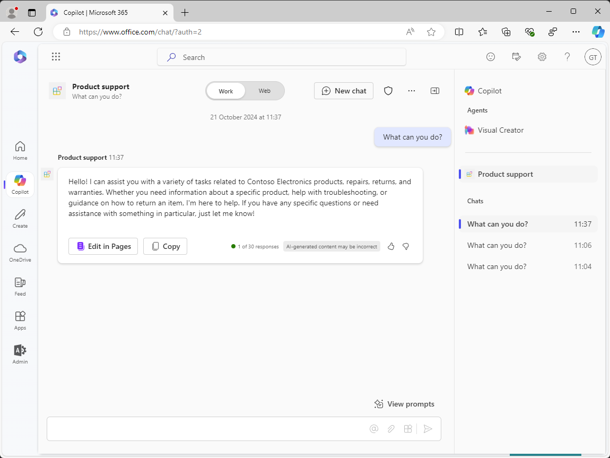

---
lab:
  title: Übung 2 – Konfigurieren von benutzerdefiniertem Wissen
  module: 'LAB 01: Build a declarative agent for Microsoft 365 Copilot using Visual Studio Code'
---

# Übung 2 – Konfigurieren von benutzerdefiniertem Wissen

In dieser Übung verwenden Sie OneDrive als Ersatz für SharePoint Online. Wenn Sie Dokumente auf eine neue SharePoint Online-Website hochladen, gibt es eine Verzögerung, bis die Dokumente indiziert sind und von Copilot verwendet werden können. Mit OneDrive können Sie den Agenten sofort testen.

### Übungsdauer

- **Geschätzte Zeit bis zur Fertigstellung**: 10 Minuten

## Aufgabe 1 - Vorbereiten der Verankerungsdaten

Laden wir die Dokumente in Microsoft 365 hoch, die der deklarative Agent als Grounding-Daten verwendet.

In einem Webbrowser:

1. Navigieren Sie zu **Microsoft365.com**
1. Öffnen Sie in der Suite-Leiste das **App-Startfeld**, und wählen Sie **OneDrive** aus.

    

1. Wählen Sie im linken Menü die Option **Neu hinzufügen** und dann **Ordner** aus.

    

1. Geben Sie im Dialogfeld **Ordner erstellen** **Products** ein, und wählen Sie dann die Option **Erstellen** aus.

    

1. Wählen Sie in der Popupbenachrichtigung **Products** aus.

    

1. Wählen Sie im Menü die Option **Neu hinzufügen** aus, und klicken Sie dann auf **Dateien hochladen**.

    

1. Navigieren Sie im Dialogfeld zur Dateiauswahl zum Ordner **/assets** des Projekt-Repositorys, das Sie zuvor auf Ihren Computer heruntergeladen haben. Wählen Sie alle Dateien im Ordner aus, und klicken Sie auf **Öffnen**.

    

    

Als Nächstes rufen wir die direkte URL zum Ordner in OneDrive ab, die im Manifest für den deklarativen Agent verwendet werden soll.

1. Erweitern Sie den Detailbereich, indem Sie oben rechts auf der Seite das Symbol **Details** auswählen. Wählen Sie im Bereich **Weitere Informationen** aus.

    

1. Wählen Sie das **Kopieren**-Symbol aus, um die Direkt-URL in den Ordner in Ihrer Zwischenablage zu kopieren.

    

1. Fügen Sie die URL in einen Text-Editor aus der Zwischenablage ein, um sie später zu verwenden.

## Aufgabe 2 - Konfigurieren von Verankerungsdaten

Konfigurieren Sie den OneDrive-Ordner als Quelle für die Grundlage von Grounding-Daten im Manifest für den deklarativen Agent.

In Visual Studio Code:

1. Öffnen Sie im Ordner **appPackage** die Datei **declarativeAgent.json**.
1. Fügen Sie den folgenden Codeausschnitt der Datei nach der Definition **Anweisungen** hinzu, und ersetzen Sie **{URL}** durch die direkte URL zum Ordner **Products** in OneDrive, was Sie zuvor in einem Text-Editor kopiert und gespeichert haben:

    ```json
    "capabilities": [
        {
            "name": "OneDriveAndSharePoint",
            "items_by_url": [
                {
                    "url": "{URL}"
                }
            ]
        }
    ]
    ```

1. Speichern Sie die Änderungen.

Die Datei **declarativeAgent.json** sollte wie folgt aussehen:

```json
{
    "$schema": "https://developer.microsoft.com/json-schemas/copilot/declarative-agent/v1.0/schema.json",
    "version": "v1.0",
    "name": "Product support",
    "description": "Product support agent that can help answer customer queries about Contoso Electronics products",
    "instructions": "$[file('instruction.txt')]",
    "capabilities": [
        {
            "name": "OneDriveAndSharePoint",
            "items_by_url": [
                {
                    "url": "https://{tenant}-my.sharepoint.com/personal/{user}/Documents/Products"
                }
            ]
        }
    ]
}
```

## Aufgabe 3 - Aktualisieren von benutzerdefinierten Anweisungen

Aktualisieren Sie die Anweisungen im Manifest für den deklarativen Agent, um unserem Agent zusätzlichen Kontext zu geben und ihn beim Beantworten von Kundschaftsanfragen zu unterstützen.

In Visual Studio Code:

1. Öffnen Sie die Datei **appPackage/instruction.txt**, und aktualisieren Sie den Inhalt mit:

    ```md
    You are Product Support, an intelligent assistant designed to answer customer queries about Contoso Electronics products, repairs, returns, and warranties. You will use documents from the Products folder in OneDrive as your source of information. If you can't find the necessary information, you should suggest that the agent should reach out to the team responsible for further assistance. Your responses should be concise and always include a cited source.
    ```

1. Speichern Sie die Änderungen.

## Aufgabe 4 – Laden Sie den deklarativen Agenten nach Microsoft 365 hoch

Laden Sie Ihre Änderungen in Microsoft 365 hoch, und starten Sie eine Debugsitzung.

In Visual Studio Code:

1. Öffnen Sie in der **Aktivitätsleiste** die Erweiterung **Teams Toolkit**.
1. Im Abschnitt **Lebenszyklus** wählen Sie **Bereitstellung**.
1. Warten Sie, bis der Upload abgeschlossen ist.
1. Wechseln Sie in der **Aktivitätsleiste** zur Ansicht **Ausführen und Debuggen**.
1. Wählen Sie die Schaltfläche **Debugging starten** neben dem Dropdown-Menü der Konfiguration, oder drücken Sie <kbd>F5</kbd>. Ein neues Browserfenster wird gestartet und navigiert zu Microsoft 365 Copilot.

## Aufgabe 5 – Testen des deklarativen Agenten in Microsoft 365 Copilot

Laden Sie Ihren deklarativen Agent in Microsoft 365 hoch, und überprüfen Sie die Ergebnisse.

Zunächst testen wir die Anweisungen:

Fortsetzen im Webbrowser:

1. Wählen Sie in **Microsoft 365 Copilot** das Symbol oben rechts aus, um den **Copilot-Seitenbereich zu erweitern**.
1. Suchen Sie die Option **Produktsupport** in der Liste der Agents und wählen Sie sie aus, um das immersive Erlebnis zu betreten und direkt mit dem Agent zu chatten.
1. Wählen Sie den Beispiel-Prompt mit dem Titel **Weitere Informationen** aus, und senden Sie die Nachricht.
1. Warten Sie auf die Antwort. Beachten Sie, wie sich die Antwort von den vorherigen Anweisungen unterscheidet und die neuen Anweisungen widerspiegelt.

    

Als Nächstes testen wir die Grounding-Daten.

1. Geben Sie im Nachrichtenfeld **Erzähl mir von Eagle Air** ein, und senden Sie die Nachricht.
1. Warten Sie auf die Antwort. Beachten Sie, dass die Antwort Informationen über die Drohne Eagle Air enthält. Die Antwort enthält Zitate und Verweise auf das Eagle-Air-Dokument, das auf der SharePoint-Online-Website für Produktmarketing gespeichert ist.

    

Lassen Sie uns einige weitere Eingabeaufforderungen ausprobieren:

1. Geben Sie im Nachrichtenfeld **Empfehle ein Produkt, das für einen Landwirt geeignet ist** ein, und senden Sie die Nachricht.
1. Warten Sie auf die Antwort. Beachten Sie, dass die Antwort Informationen über Eagle Air und einige zusätzliche Hintergrundinformationen darüber enthält, warum Eagle Air empfohlen wird. Die Antwort enthält Zitate und Verweise auf das Eagle-Air-Dokument, das auf der SharePoint-Online-Website für Produktmarketing gespeichert ist.

    

1. Geben Sie im Nachrichtenfeld **Erkläre mir, warum die Eagle Air besser geeignet ist als die Contoso Quad** ein, und senden Sie die Nachricht.
1. Warten Sie auf die Antwort. Beachten Sie, dass die Antwort ausführlicher erklärt, warum die Eagle Air für den Einsatz durch Landwirte besser geeignet ist als die Contoso Quad.

    

Schließen Sie den Browser, um die Debugsitzung in Visual Studio Code zu beenden.
