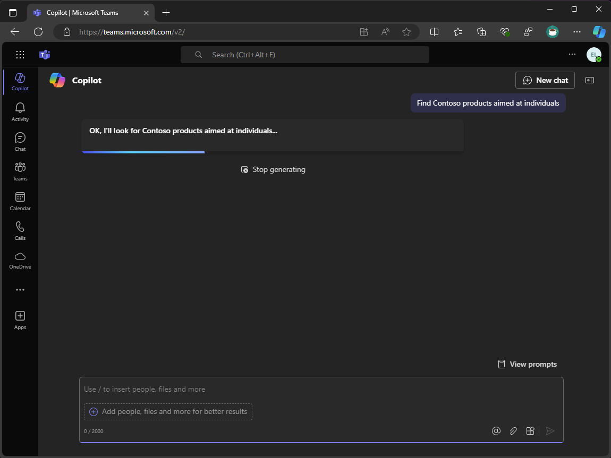
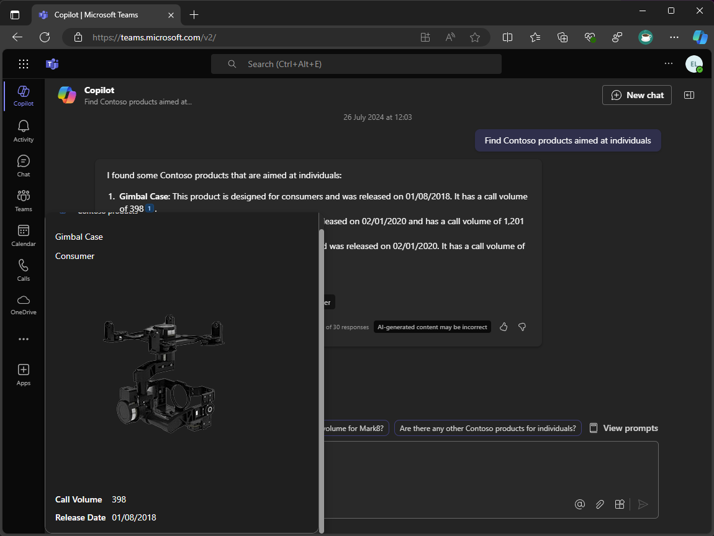

---
lab:
  title: Übung 4 – Erweitern und Optimieren von Nachrichtenerweiterungen für die Verwendung mit Copilot für Microsoft 365
  module: 'LAB 01: Connect Microsoft 365 Copilot to your external data in real-time with message extension plugins built with .NET and Visual Studio'
---

# Übung 4 – Erweitern und Optimieren von Nachrichtenerweiterungen für die Verwendung mit Copilot für Microsoft 365

In dieser Übung erweitern und optimieren Sie die Nachrichtenerweiterung für die Verwendung mit Copilot für Microsoft 365. Sie fügen einen neuen Parameter namens Zielgruppe hinzu und aktualisieren die Nachrichtenerweiterungslogik, um mehrere Parameter zu verarbeiten. Zum Schluss debuggen Sie Ihre Nachrichtenerweiterung und testen sie in Copilot in Microsoft Teams.


> [!NOTE]
> Die einzige Aufgabe in dieser Übung, die eine Microsoft 365 Copilot-Lizenz erfordert, ist Aufgabe 5. Die vorherigen Aufgaben sollten ausgeführt werden, unabhängig davon, ob Ihr Mandant Über Copilot verfügt oder nicht.

### Übungsdauer

  - **Geschätzter Zeitaufwand**: 40 Minuten

## Aufgabe 1 – Aktualisieren der App-Beschreibung

Die Angabe kurzer und präziser Beschreibungen im App-Manifest stellt sicher, dass Copilot weiß, wann und wie Ihr Plug-In aufgerufen werden soll. Aktualisieren Sie die App-, Befehls- und Parameterbeschreibungen im App-Manifest.

Öffnen Sie Visual Studio und wählen Sie das Projekt **TeamsApp**:

1. Öffnen Sie im Ordner **appPackage** die Datei **manifest.json**.

1. Aktualisieren der **Beschreibung** des Objekts

    ```json
    "description": {
        "short": "Product look up tool.",
        "full": "Get real-time product information and share them in a conversation. Search by product name or target audience. ${{APP_DISPLAY_NAME}} works with Microsoft 365 Chat. Find products at Contoso. Find Contoso products called mark8. Find Contoso products named mark8. Find Contoso products related to Mark8. Find Contoso products aimed at individuals. Find Contoso products aimed at businesses. Find Contoso products aimed at individuals with the name mark8. Find Contoso products aimed at businesses with the name mark8."
    },
    ```

## Aufgabe 2 – Hinzufügen eines neuen Parameters

Fügen Sie nun einen neuen Parameter hinzu, den Copilot verwenden kann. Dieser neue Parameter hilft Benutzenden bei der Suche mit Copilot nach Produkten, die auf verschiedene Zielgruppen ausgerichtet sind, wie z. B. natürliche Personen und Unternehmen.

Fortfahren in Visual Studio und im **TeamsApp**-Projekt :

1. Fügen Sie in der **manifest.json** im Array **parameters** den Parameter **TargetAudience** nach dem Parameter **ProductName** hinzu:

    ```json
    "parameters": [
        {
            "name": "ProductName",
            "title": "Product name",
            "description": "The name of the product as a keyword",
            "inputType": "text"
        },
        {
            "name": "TargetAudience",
            "title": "Target audience",
            "description": "Audience that the product is aimed at. Consumer products are sold to individuals. Enterprise products are sold to businesses",
            "inputType": "text"
        }
    ]
    ```

1. Speichern Sie die Änderungen.

Die Beschreibung des **TargetAudience**-Parameters beschreibt, was er ist und erläutert, dass der Parameter **Consumer**- oder **Enterprise**-Werte akzeptieren soll.

Aktualisieren Sie als Nächstes die Befehlsbeschreibung, um den neuen Parameter einzuschließen.

1. Aktualisieren Sie im Array **Befehle** die **Beschreibung** des Befehls in **Zeile 36**:

    ```json
    "description": "Find products by name or by target audience.",
    ```

## Aufgabe 3 – Aktualisieren der Nachrichtenerweiterungslogik

Um den neuen Parameter und komplexe Aufforderungen zu unterstützen, aktualisieren Sie die Methode **OnTeamsMessagingExtensionQueryAsync** im Aktivitätshandler-Bot, um mehrere Parameter zu verarbeiten.

Aktualisieren Sie zunächst die Klasse **ProductService**, um Produkte auf der Grundlage der Parameter „Name“ und „Zielgruppe“ abzurufen.

Weiter geht es in Visual Studio im Projekt **ProductPlugin**:

1. Öffnen Sie im Ordner **Services** die Datei **ProductsService.cs**.

1. Erstellen Sie in der Datei neue Methoden namens **GetProductsByCategoryAsync** und **GetProductsByNameAndCategoryAsync**:

    ```csharp
    internal async Task<Product[]> GetProductsByCategoryAsync(string category)
    {
        var response = await _httpClient.GetAsync($"{_baseUri}products?category={category}");
        response.EnsureSuccessStatusCode();
        var jsonString = await response.Content.ReadAsStringAsync();
        return System.Text.Json.JsonSerializer.Deserialize<Product[]>(jsonString);
    }
    internal async Task<Product[]> GetProductsByNameAndCategoryAsync(string name, string category)
    {
        var response = await _httpClient.GetAsync($"{_baseUri}?name={name}&category={category}");
        response.EnsureSuccessStatusCode();
        var jsonString = await response.Content.ReadAsStringAsync();
        return System.Text.Json.JsonSerializer.Deserialize<Product[]>(jsonString);
    }
    ```

1. Speichern Sie die Änderungen.

Als Nächstes fügen Sie der Klasse **MessageExtensionHelper** eine neue Methode hinzu, um Produkte auf der Grundlage der Parameter Name und Zielgruppe abzurufen.

1. Öffnen Sie im Ordner **Helpers** die Datei **MessageExtensionHelper.cs**.

1. Erstellen Sie in der Datei eine neue Methode mit dem Namen **RetrieveProducts**, die Produkte auf der Grundlage der Parameter Name und Zielgruppe abruft:

    ```csharp
    internal static async Task<IList<Product>> RetrieveProducts(string name, string audience, ProductsService productsService)
    {
        IList<Product> products;
        if (string.IsNullOrEmpty(name) && !string.IsNullOrEmpty(audience))
        {
            products = await productsService.GetProductsByCategoryAsync(audience);
        }
        else if (!string.IsNullOrEmpty(name) && string.IsNullOrEmpty(audience))
        {
            products = await productsService.GetProductsByNameAsync(name);
        }
        else if (!string.IsNullOrEmpty(name) && !string.IsNullOrEmpty(audience))
        {
            products = await productsService.GetProductsByNameAndCategoryAsync(name, audience);
        }
        else
        {
            products = [];
        }
        return products;
    }
    ```

1. Speichern Sie die Änderungen.

Die Methode **RetrieveProduct** ruft Produkte anhand der Parameter Name und Zielgruppe ab. Wenn der Parameter Name leer ist und der Parameter Zielgruppe nicht leer ist, ruft die Methode Produkte auf der Grundlage des Parameters Zielgruppe ab. Wenn der Parameter Name nicht leer ist und der Parameter Zielgruppe leer ist, ruft die Methode die Produkte auf der Grundlage des Parameters Name ab. Wenn sowohl der Parameter Name als auch der Parameter Zielgruppe nicht leer sind, sucht die Methode nach Produkten, die auf beiden Parametern basieren. Wenn beide Parameter leer sind, gibt die Methode eine leere Liste zurück.

Als nächstes aktualisieren Sie die Klasse **SearchApp**, um den neuen Parameter zu behandeln.

1. Im Ordner **Search** öffnen Sie **SearchApp.cs**..

1. Ersetzen Sie in der Methode **OnTeamsMessagingExtensionQueryAsync** den folgenden Code ab **Zeile 30**:

    ```csharp
    var name = MessageExtensionHelpers.GetQueryParameterValueByName(query.Parameters, "ProductName");
    var productService = new ProductsService(tokenResponse.Token);
    var products = await productService.GetProductsByNameAsync(name);
    ```

    durch:

    ```csharp
    var name = MessageExtensionHelpers.GetQueryParameterValueByName(query.Parameters, "ProductName");
    var audience = MessageExtensionHelpers.GetQueryParameterValueByName(query.Parameters, "TargetAudience");
    var productService = new ProductsService(tokenResponse.Token);
    var products = await MessageExtensionHelpers.RetrieveProducts(name, audience, productService);
    ```

1. Speichern Sie die Änderungen.

Die Methode **OnTeamsMessagingExtensionQueryAsync** ruft jetzt den Namen und die Publikumsparameter aus den Abfrageparametern ab. Anschließend werden mit der Methode **RetrieveProducts** Produkte auf der Grundlage der Parameter Name und Zielgruppe abgerufen.

## Aufgabe 4 – Erstellen und Aktualisieren von Ressourcen

Wenn nun alles vorhanden ist, führen Sie den Prozess **Prepare Teams App Dependencies** aus, um neue Ressourcen zu erstellen und bestehende zu aktualisieren.

Fortsetzen in Visual Studio:

1. Klicken Sie im **Solution Explorer** mit der rechten Maustaste auf das Projekt **TeamsApp**.

1. Erweitern Sie das Menü **Teams Toolkit** und wählen Sie **Teams App-Abhängigkeiten vorbereiten**.

1. Wählen Sie im Dialog **Microsoft 365-Konto** die Option **Fortfahren**

1. Im Dialog **Bereitstellung** wählen Sie **Bereitstellung**

1. Wählen Sie im Dialog **Teams Toolkit Warnung** die Option **Bereitstellung**

1. Wählen Sie im Dialog **Teams Toolkit Informationen** das Kreuzsymbol aus, um den Dialog zu schließen.

## Aufgabe 5 – Ausführen und Debuggen

Starten Sie mit den bereitgestellten Ressourcen eine Debugsitzung, um die Nachrichtenerweiterung zu testen.

Starten Sie zunächst **Dev Proxy** , um die benutzerdefinierte API zu simulieren.

1. Führen Sie in dem **Eingabeaufforderungsfenster**, das Sie noch geöffnet haben, den folgenden Befehl aus, um Dev Proxy zu starten:

1. Führen Sie den folgenden Befehl aus, um Dev Proxy zu starten:

   ```bash
   devproxy --config-file "~appFolder/presets/learn-copilot-me-plugin/products-api-config.json"
   ```

1. Wenn Sie dazu aufgefordert werden, akzeptieren Sie die Zertifikatswarnungen.

> [!NOTE]
> Wenn Dev Proxy ausgeführt wird, fungiert er als systemweiter Proxy.

Starten Sie anschließend eine Debug-Sitzung in Visual Studio:

1. Um eine neue Debug-Sitzung zu starten, drücken Sie <kbd>F5</kbd> oder wählen Sie **Start** in der Symbolleiste.

1. Warten Sie, bis sich ein Browser-Fenster öffnet und der Dialog zur Installation der App im Microsoft Teams-Webclient angezeigt wird. Wenn Sie dazu aufgefordert werden, geben Sie die Anmeldeinformationen für Ihr Microsoft 365-Konto an.

1. Wählen Sie im Installationsdialog der App **Hinzufügen** aus.

1. Öffnen Sie die **Copilot** App in Microsoft Teams

1. Öffnen Sie im Bereich zum Verfassen von Nachrichten das Flyout **Plugins**.

1. Schalten Sie in der Liste der Plugins das Plugin **Contoso-Produkte** ein, um es zu aktivieren.

    

1. Geben Sie **Finden Sie Contoso-Produkte für Privatpersonen** als Ihre Nachricht ein und senden Sie sie ab.

1. Warten Sie, bis Copilot antwortet:

    

1. In der Copilot-Antwort werden die in der Plugin-Antwort zurückgegebenen Daten angezeigt und das Plugin wird in der Antwort referenziert:

    

1. Um die für das Ergebnis relevante adaptive Karte anzuzeigen, bewegen Sie den Mauszeiger über die Referenzen in der Copilot-Antwort:

    

Kehren Sie zu Visual Studio zurück und wählen Sie **Anhalten** aus der Symbolleiste aus oder drücken Sie <kbd>Umschalt</kbd> + <kbd>F5</kbd>, um die Debug-Sitzung zu beenden. Schalten Sie außerdem Dev Proxy mit <kbd>Strg</kbd> + <kbd>C</kbd> aus.

[Weiter zur Lab-Zusammenfassung...](./6-summary.md)