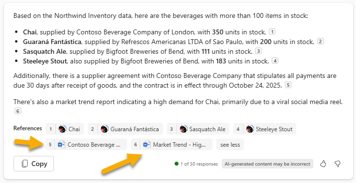
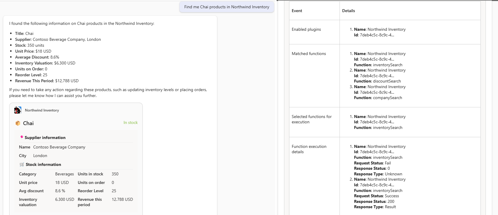

---
lab:
  title: Übung 2 – Ausführen des Beispiels als Copilot-Plug-In
  module: 'LAB 02: Build your own message extension plugin with TypeScript (TS) for Microsoft Copilot'
---

# Übung 2 – Ausführen des Beispiels als Copilot-Plug-In

In dieser Übung führen Sie die Anwendung als Plug-In für Microsoft Copilot für Microsoft 365 aus. Sie experimentieren mit verschiedenen Eingabeaufforderungen und beobachten, wie das Plug-In mithilfe verschiedener Parameter aufgerufen wird.

> [!NOTE]  
> Um die folgende Übung auszuführen, muss Ihr Konto über eine gültige Lizenz für Copilot für Microsoft 365 verfügen.

## Aufgabe 1 – Test in Microsoft Copilot für Microsoft 365 (einzelner Parameter)

1. Wählen Sie in der Anwendungsschiene auf der linken Seite die **Copilot**-App aus.

1. Wählen Sie auf der rechten Seite des Felds zum Verfassen das Symbol **Plug-In **1️⃣ aus, und aktivieren Sie das **Northwind Inventory**-Plug-In 2️⃣.

    

1. Um optimale Ergebnisse zu erzielen, wählen Sie oben rechts vor jeder Eingabeaufforderung oder einem Satz verwandter Eingabeaufforderungen das Symbol ** Neuer Chat** aus.

    

1. Probieren Sie die folgenden Eingabeaufforderungen aus, die nur einen einzelnen Parameter der Messaging-Erweiterung verwenden:

    - _Suchen Sie nach Informationen zu Chai in Northwind Inventory._

    - _Suchen Sie nach ermäßigten Meeresfrüchte in Northwind. Zeigen Sie eine Tabelle mit den Produkten, den Namen der Lieferanten, dem durchschnittlichen Rabattsatz und dem Umsatz pro Zeitraum an._

Die letzte sollte auf die Dokumente verweisen, die Sie auf OneDrive hochgeladen haben. Sehen Sie sich beim Testen die Protokollmeldungen in Visual Studio Code an. Sie sollten sehen können, wann Copilot Ihr Plug-In aufruft und eine Abfrage sendet. Nach dem Anfordern von ** rabattierten Meeresfrüchten** hat Copilot diese Abfrage z. B. mit dem Befehl `discountSearch`  ausgestellt.


Möglicherweise werden Zitate der Northwind-Daten in drei Formularen angezeigt. Wenn ein einzelner Verweis vorhanden ist, zeigt Copilot möglicherweise die gesamte Karte an.


Wenn mehrere Verweise vorhanden sind, zeigt Copilot möglicherweise eine kleine Zahl neben jedem an. Sie können mit der Maus auf diese Nummern zeigen, um die adaptive Karte anzuzeigen. Verweise werden auch unterhalb der Antwort aufgeführt.


Probieren Sie diese adaptiven Karten aus, um Maßnahmen für die Produkte zu ergreifen. Beachten Sie, dass sich dies nicht auf frühere Antworten von Copilot auswirkt.

Versuchen Sie, Ihre eigenen Eingabeaufforderungen zu erstellen. Sie werden feststellen, dass sie nur funktionieren, wenn Copilot das Plug-In nach den erforderlichen Informationen abfragen kann. Dies unterstreicht die Notwendigkeit, die Arten von Eingabeaufforderungen zu antizipieren, die Benutzerinnen und Benutzer ausgeben werden, und entsprechende Abfragetypen für jede Anfrage bereitzustellen. Wenn Sie mehrere Parameter haben, wird dies effizienter!

## Aufgabe 2 – Test in Microsoft Copilot für Microsoft 365 (mehrere Parameter)

In dieser Übung probieren Sie einige Eingabeaufforderungen aus, die das Feature mit mehreren Parametern im Beispiel-Plug-In nutzen. Diese Eingabeaufforderungen fordern Daten an, die nach **Name**, **Kategorie**, **Bestandsstatus**, **Lieferantenstadt** und **Lagerbestand** abgerufen werden können, wie im **App-Manifest** definiert.

Versuchen Sie beispielsweise die Eingabeaufforderung **_Nach Northwind-Getränken mit mehr als 100 Artikeln auf Lager suchen_**. Um seine Antwort zu generieren, muss Copilot Produkte identifizieren:

- Wo die Kategorie ** Getränke** lautet.
  
  _AND_

- Wo der Bestandsstatus **auf Lager** lautet.

  _AND_

- Wo der **Lagerbestand** größer als **100** ist.

Wenn Sie sich die Protokolldatei ansehen, können Sie sehen, dass Copilot diese Anforderung verstehen konnte und 3 der Parameter im ersten Massaging-Erweiterungsbefehl ausfüllen konnte.


Der Plug-In-Code wendet alle drei Filter an und stellt ein Resultset von nur vier Produkten bereit. Copilot verwendet die Informationen auf den resultierenden adaptiven Karten und rendert ein ähnliches Ergebnis wie dieses:


Mit dieser Eingabeaufforderung kann Copilot auch in Ihren OneDrive-Dateien nachsehen, um die Zahlungsbedingungen in den Verträgen der einzelnen Lieferanten zu finden. In diesem Fall werden Sie feststellen, dass einige der Verweise nicht das Symbol **Nordwind-Inventory**, sondern das Symbol **Wort** haben.



Hier sind einige weitere Eingabeaufforderungen zum Ausprobieren:

- _Finden Sie Northwind Molkereiprodukte, die nur noch wenig auf Lager sind. Zeigen Sie mir eine Tabelle mit dem Produkt, dem Lieferanten, den vorrätigen und den bestellten Einheiten._

- _Wir haben Teilbestellungen für Tofu erhalten. Finden Sie den Lieferanten in Northwind und verfassen Sie eine E-Mail, in der Sie unseren Bestand zusammenfassen und ihn daran erinnern, dass er gemäß unserer MOQ-Richtlinie keine Teilbestellungen mehr verschicken soll._

- _Northwind wird mit einem Stand auf den Microsoft Community Days in London vertreten sein. Finden Sie Produkte bei lokalen Anbietern und schreiben Sie einen LinkedIn-Post, um den Stand und die Produkte zu bewerben. Betonen Sie, wie lecker die Produkte sind, und ermutigen Sie die Leute, unseren Stand zu besuchen._

- _Welches Getränk ist aufgrund der sozialen Medien sehr gefragt, das in Northwind in London nur noch wenig auf Lager ist. Verweisen Sie auf die Produktdetails, um den Bestand zu aktualisieren._

Welche Eingabeaufforderungen funktionieren für Sie am besten? Versuchen Sie, Ihre eigenen Eingabeaufforderungen zu erstellen und beobachten Sie Ihre Protokollmeldungen, um zu sehen, wie Copilot auf Ihr Plug-In zugreift.

### Tipp zur Problembehandlung

Wenn Sie beim Testen Ihres Plugins auf Probleme stoßen, können Sie den **Entwicklermodus** aktivieren. Der Entwicklermodus liefert Informationen über das Plugin, das vom Copilot-Orchestrator ausgewählt wurde, um auf die Eingabeaufforderung zu reagieren. Außerdem werden die im Plugin verfügbaren Funktionen und der Statuscode des API-Aufrufs angezeigt.

Um den Entwicklermodus zu aktivieren, geben Sie Folgendes in Copilot ein:

```console
-developer on
```

Führen Sie Ihre Eingabeaufforderung aus, und der Entwicklermodus gibt Ergebnisse aus, die ähnlich aussehen wie diese: 



Wie Sie sehen können, haben wir unter der von Copilot generierten Antwort eine Tabelle, die uns einblickereiche Informationen darüber liefert, was hinter den Kulissen passiert ist:

- Unter **Aktivierte Plugins** sehen Sie, dass Copilot festgestellt hat, dass das Northwind Inventory Plugin aktiviert ist.

- Unter **Zugehörige Funktionen** können Sie sehen, dass Copilot festgestellt hat, dass das Northwind-Inventory-Plugin drei Funktionen anbietet: `inventorySearch`, `discountSearch`, und `companySearch`.

- Unter **Ausgewählte Funktionen zur Ausführung** sehen Sie, dass Copilot die Funktion `inventorySearch` ausgewählt hat, um auf die Eingabeaufforderung zu reagieren.

- Unter **Details zur Funktionsausführung** sehen Sie einige detaillierte Informationen zur Ausführung, wie z.B. die HTTP-Antwort, die das Plugin an die Copilot-Engine zurückgibt.

## Arbeit überprüfen

Nachdem Sie die Aufgaben in dieser Übung abgeschlossen haben, sollten Sie in der Lage sein, das **Northwind Inventory** Plugin in Copilot für Microsoft 365 zu verwenden. 

Wenn Sie diese Übung abgeschlossen haben, können Sie der Messaging-Erweiterung einen neuen Befehl hinzufügen, um die Möglichkeiten des Plugins zu erweitern und weitere Aufgaben auszuführen. 

[Fahren Sie mit der nächsten Übung fort...](./5-exercise-3-add-new-command.md)
