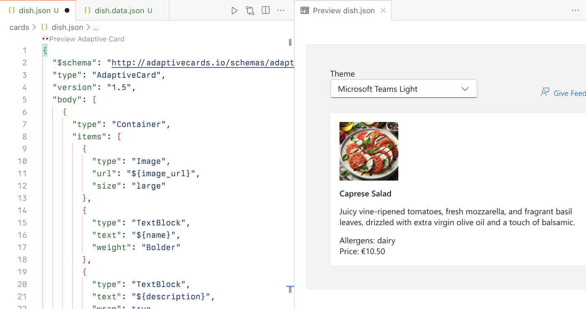

---
lab:
  title: Übung 1 – Projekt herunterladen und eine adaptive Karte erstellen
  module: 'LAB 03: Use Adaptive Cards to show data in API plugins for declarative agents'
---

# Übung 1 – Projekt herunterladen und eine adaptive Karte erstellen

Beginnen wir mit dem Erstellen von Vorlagen für adaptive Karten für den Agenten, um die Daten in ihren Antworten anzuzeigen. Um die Vorlage für adaptive Karten zu erstellen, verwenden Sie die Visual Studio Code-Erweiterungen für adaptive Karten, um ihre Arbeit ganz einfach direkt in Visual Studio Code anzuzeigen. Mithilfe der Erweiterung können wir eine Vorlage für adaptive Karten mit Verweisen auf Daten erstellen. Während der Laufzeit füllt der Agent den Platzhalter mit Daten, die er von der API abruft.

### Übungsdauer

- **Geschätzte Zeit bis zur Fertigstellung**: 10 Minuten

## Aufgabe 1 -- Herunterladen des Startprojekts

Laden Sie zunächst das Beispielprojekt herunter. In einem Webbrowser:

1. Navigieren Sie zu [https://github.com/microsoft/learn-declarative-agent-api-plugin-adaptive-cards-typescript](https://github.com/microsoft/learn-declarative-agent-api-plugin-adaptive-cards-typescript).
  1. Führen Sie die Schritte aus, um [den Quellcode des Repositorys](https://docs.github.com/repositories/working-with-files/using-files/downloading-source-code-archives#downloading-source-code-archives-from-the-repository-view) auf Ihren Computer herunterzuladen.
  1. Extrahieren Sie den Inhalt der heruntergeladenen ZIP-Datei, und erweitern Sie ihn in Ihren **Dokumentenordner**.
  1. Öffnen Sie in Visual Studio Code den Ordner .

Das Beispielprojekt ist ein Teams Toolkit-Projekt, das einen deklarativen Agent mit einer Aktion enthält, die mit einem API-Plug-In erstellt wurde. Das API-Plug-In stellt eine Verbindung zu einer anonymen API her, die auf Azure Functions ausgeführt wird und ebenfalls im Projekt enthalten ist. Die API gehört zu einem fiktiven italienischen Restaurant und ermöglicht es Ihnen, das heutige Menü und die Bestellung zu durchsuchen.

## Aufgabe 2 – Erstellen einer adaptiven Karte für ein Gericht

Erstellen Sie zunächst eine adaptive Karte, die Informationen zu einem einzelnen Gericht anzeigt.

In Visual Studio Code:

1. Erstellen Sie in der Ansicht **Explorer** einen neuen Ordner namens **Karten**.
1. Erstellen Sie im Ordner **Karten** eine neue Datei namens **dish.json**. Fügen Sie den folgenden Inhalt ein, der eine leere adaptive Karte darstellt:

  ```json
  {
    "$schema": "http://adaptivecards.io/schemas/adaptive-card.json",
    "type": "AdaptiveCard",
    "version": "1.5",
    "body": []
  }
  ```

1. Bevor Sie fortfahren, suchen Sie auf der Registerkarte **Erweiterungen** der Aktivitätsleiste nach der Erweiterung **Vorschau für adaptive Karten** und installieren diese:
  1. Öffnen Sie die Befehlspalette, indem Sie <kbd>STRG</kbd>+<kbd>P</kbd> auf der Tastatur drücken. Geben Sie `>Adaptive` ein, um Befehle für die Arbeit mit adaptiven Karten zu finden.

    

  1. Wählen Sie aus der Liste **Adaptive Karte: Neue Datendatei**. Visual Studio Code erstellt eine neue Datei namens **dish.data.json**.
  1. Ersetzen Sie seinen Inhalt durch Daten, die ein Gericht darstellen:

  ```json
  {
    "id": 4,
    "name": "Caprese Salad",
    "description": "Juicy vine-ripened tomatoes, fresh mozzarella, and fragrant basil leaves, drizzled with extra virgin olive oil and a touch of balsamic.",
    "image_url": "https://raw.githubusercontent.com/pnp/copilot-pro-dev-samples/main/samples/da-ristorante-api/assets/caprese_salad.jpeg",
    "price": 10.5,
    "allergens": [
    "dairy"
    ],
    "course": "lunch",
    "type": "dish"
  }
  ```

  1. Speichern Sie Ihre Änderungen.
1. Wechseln Sie zurück zur Datei **dish.json**.
1. Wählen Sie aus dem Menüpunkt **Vorschau für adaptive Karten** aus.

  

  Visual Studio Code öffnet eine Vorschau der Karte an der Seite. Während Sie die Karte bearbeiten, sind Ihre Änderungen sofort auf der Seite sichtbar.

1. Fügen Sie dem **Text**-Array ein **Container**-Element mit einem Verweis auf die Bild-URL hinzu, die in der Eigenschaft **image_url** gespeichert ist.

  ```json
  {
    "type": "Container",
    "items": [
    {
      "type": "Image",
      "url": "${image_url}",
      "size": "large"
    }
    ]
  }
  ```

  Beachten Sie, wie die Kartenvorschau automatisch aktualisiert wird, um Ihre Karte anzuzeigen:

  

1. Fügen Sie Verweise auf andere Gerichteigenschaften hinzu. Die vollständige Karte sieht wie folgt aus:

  ```json
  {
    "$schema": "http://adaptivecards.io/schemas/adaptive-card.json",
    "type": "AdaptiveCard",
    "version": "1.5",
    "body": [
    {
      "type": "Container",
      "items": [
      {
        "type": "Image",
        "url": "${image_url}",
        "size": "large"
      },
      {
        "type": "TextBlock",
        "text": "${name}",
        "weight": "Bolder"
      },
      {
        "type": "TextBlock",
        "text": "${description}",
        "wrap": true
      },
      {
        "type": "TextBlock",
        "text": "Allergens: ${if(count(allergens) > 0, join(allergens, ', '), 'none')}",
        "weight": "Lighter"
      },
      {
        "type": "TextBlock",
        "text": "**Price:** €${formatNumber(price, 2)}",
        "weight": "Lighter",
        "spacing": "None"
      }
      ]
    }
    ]
  }
  ```

  

  Beachten Sie, dass Sie zum Anzeigen von Allergenen eine Funktion verwenden, um die Allergene zu einer Zeichenfolge zu verbinden. Wenn ein Gericht keine Allergene enthält, zeigen Sie **keine** an. Um sicherzustellen, dass die Preise richtig formatiert sind, verwenden Sie die Funktion **formatNumber**, mit der wir die Anzahl der Dezimalstellen angeben können, die auf der Karte angezeigt werden sollen.

## Aufgabe 3 – Erstellen einer adaptiven Karte für die Bestellzusammenfassung

Mit der Beispiel-API können Benutzende das Menü durchsuchen und eine Bestellung aufgeben. Erstellen wir nun eine adaptive Karte, die die Bestellzusammenfassung anzeigt.

In Visual Studio Code:

1. Erstellen Sie im Ordner **Karten** eine neue Datei namens **order.json**. Fügen Sie den folgenden Inhalt ein, der eine leere adaptive Karte darstellt:

  ```json
  {
    "$schema": "http://adaptivecards.io/schemas/adaptive-card.json",
    "type": "AdaptiveCard",
    "version": "1.5",
    "body": []
  }
  ```

1. Erstellen Sie eine Datendatei für die adaptive Karte:
  1. Öffnen Sie die Befehlspalette, indem Sie <kbd>STRG</kbd>+<kbd>P</kbd> (<kbd>CMD</kbd>+<kbd>P</kbd> unter macOS) auf der Tastatur drücken. Geben Sie `>Adaptive` ein, um Befehle für die Arbeit mit adaptiven Karten zu finden.

    

  1. Wählen Sie aus der Liste **Adaptive Karte: Neue Datendatei**. Visual Studio Code erstellt eine neue Datei mit dem Namen **order.data.json**.
  1. Ersetzen Sie den Inhalt durch Daten, die die Bestellzusammenfassung darstellen:

    ```json
    {
      "order_id": 6210,
      "status": "confirmed",
      "total_price": 25.48
    }
    ```

  1. Speichern Sie Ihre Änderungen.
1. Wechseln Sie zurück zur Datei **order.json**.
1. Wählen Sie aus dem Menüpunkt **Vorschau für adaptive Karten** aus.
1. Als nächstes ersetzen Sie den Inhalt der Datei **order.json** durch den folgenden Code:

  ```json
  {
    "$schema": "http://adaptivecards.io/schemas/adaptive-card.json",
    "type": "AdaptiveCard",
    "version": "1.5",
    "body": [
    {
      "type": "TextBlock",
      "text": "Order Confirmation 🤌",
      "size": "Large",
      "weight": "Bolder",
      "horizontalAlignment": "Center"
    },
    {
      "type": "Container",
      "items": [
      {
        "type": "TextBlock",
        "text": "Your order has been successfully placed!",
        "weight": "Bolder",
        "spacing": "Small"
      },
      {
        "type": "FactSet",
        "facts": [
        {
          "title": "Order ID:",
          "value": "${order_id} "
        },
        {
          "title": "Status:",
          "value": "${status}"
        },
        {
          "title": "Total Price:",
          "value": "€${formatNumber(total_price, 2)}"
        }
        ]
      }
      ]
    }
    ]
  }
  ```

  Genau wie im vorherigen Abschnitt ordnen Sie jedes Element auf der Karte einer Dateneigenschaft zu.

  

  > [!IMPORTANT]
  > Beachten Sie das nachfolgende Leerzeichen nach **${order_id}**. Dies ist beabsichtigt, da es ein bekanntes Problem mit der Darstellung von Zahlen auf adaptiven Karten gibt. Um es zu testen, entfernen Sie den Leerraum, und sehen Sie, dass die Zahl aus der Vorschau verschwindet.
  >
  > 

  Stellen Sie den nachgestellten Speicherplatz wieder her, damit Ihre Karte ordnungsgemäß angezeigt wird und Ihre Änderungen gespeichert werden.