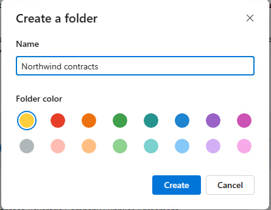
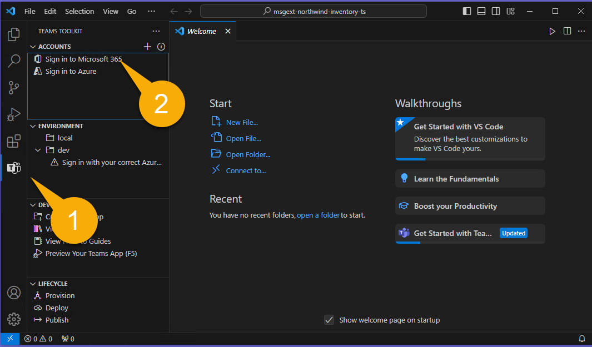
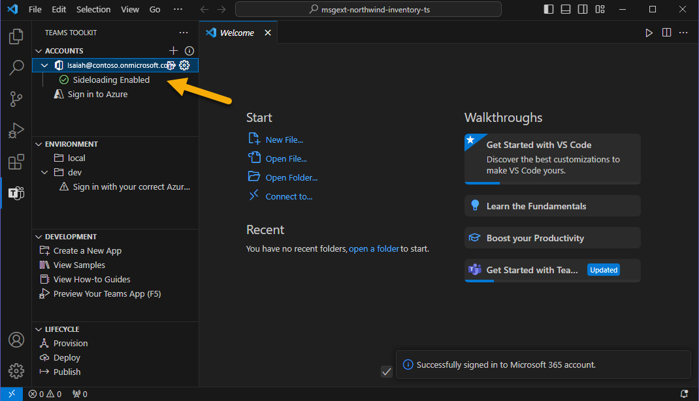

---
lab:
  title: Vorbereiten Ihrer Entwicklungsumgebung
  module: 'LAB 03: Build your own message extension plugin with TypeScript (TS) for Microsoft Copilot'
---

# Vorbereiten Ihrer Entwicklungsumgebung

Zunächst sollten Sie Ihre Entwicklungsumgebung, Ihre Konten und Ihre Software vorbereiten. Bevor Sie beginnen können, müssen Sie die folgenden Aufgaben erledigen.

## Aufgabe 1 - Voraussetzungen installieren

> [!IMPORTANT]
> Um dieses Projekt erfolgreich abzuschließen, benötigen Sie ein Microsoft 365-Konto mit der Berechtigung zum Hochladen von Anwendungen. Um **Übung 2** abzuschließen, muss das Konto auch für Microsoft Copilot für Microsoft 365 lizenziert sein.

Wenn Sie einen neuen Mandanten verwenden, ist es eine gute Idee, sich auf der [Microsoft 365-Seite](https://office.com) unter [https://office.com](https://office.com) anzumelden, bevor Sie beginnen. Je nachdem, wie der Mandant konfiguriert ist, werden Sie möglicherweise aufgefordert, eine Mulit-Faktor-Authentifizierung einzurichten. Stellen Sie sicher, dass Sie auf Microsoft Teams und Microsoft Outlook zugreifen können, bevor Sie fortfahren.

Die folgenden Tools wurden bereits im Lab auf der **MS-4010-DEVBOX** installiert. Bitte vergewissern Sie sich, dass sie installiert und funktionsfähig sind:

1. [Visual Studio Code](https://code.visualstudio.com/) (neueste Version)

1. [Azure Storage Explorer](https://azure.microsoft.com/products/storage/storage-explorer/) - Laden Sie diesen herunter, wenn Sie die in diesem Beispiel verwendete Northwind-Datenbank anzeigen und bearbeiten möchten.

## Aufgabe 2 - nvm-windows installieren

Sie werden dieses Tool verwenden, um Node.js zu installieren und optional bei Bedarf Knotenversionen für Ihre Projekte zu wechseln.

1. Navigieren Sie hierzu in einem Webbrowser zu [https://github.com/coreybutler/nvm-windows/releases](https://github.com/coreybutler/nvm-windows/releases).
2. Suchen Sie die neueste Releaseversion, und wählen Sie die **nvm-setup.zip**-Datei zum Herunterladen aus.  Die Datei wird auf Ihren Computer heruntergeladen werden.
3. Öffnen Sie den Dateiordner, und **extrahieren** Sie den Inhalt des ZIP-Ordners in einen Ordner auf Ihrem Computer.
4. Wählen Sie im neuen Ordner **nvm-setup.exe** aus, um die Setupdatei zu öffnen.
5. Folgen Sie den Anweisungen im Installationsprogramm, um das Tool mithilfe der Standardoptionen zu installieren.
6. Nvm für Windows wird auf Ihrem Computer installiert werden.

## Aufgabe 3 - Node.js installieren

Installieren Sie Node.js Version 18.18.2, die mit allen Lösungen in diesem Kurs kompatibel ist.

1. Öffnen Sie die Anwendung **Eingabeaufforderung**.
2. Geben Sie den Befehl `nvm install 18.18` ein, um Node.js zu installieren.
3. Die nvm-Ausgabe sollte bestätigen, dass die Installation abgeschlossen ist.
4. Führen Sie den Befehl `nvm use 18.18` aus, um diese Version von Node.js zu verwenden.
5. Führen Sie den Befehl `node -v` aus, um zu bestätigen, dass Sie Version 18.18.2 installiert haben.

Sie haben nun Node.js Version 18.18.2 installiert und konfiguriert

## Aufgabe 4 - Herunterladen des Beispielcodes

Bitte [klonen](https://github.com/OfficeDev/Copilot-for-M365-Plugins-Samples.git) oder [downloaden](https://github.com/OfficeDev/Copilot-for-M365-Plugins-Samples.git) Sie das Beispiel-Repository: [https://github.com/OfficeDev/Copilot-for-M365-Plugins-Samples/](https://github.com/OfficeDev/Copilot-for-M365-Plugins-Samples/).

Navigieren Sie innerhalb des geklonten oder heruntergeladenen Repositorys zum Ordner **samples/msgext-northwind-inventory-ts**. In diesen Labs wird dies als "**Arbeitsordner**" bezeichnet, da Sie dort arbeiten werden.

## Aufgabe 3 - Kopieren von Beispieldokumenten in OneDrive

Die Beispielanwendung enthält einige Dokumente, auf die Copilot während der Labs Bezug nehmen kann. In dieser Aufgabe kopieren Sie diese Dateien in das OneDrive Ihres Benutzenden, damit Copilot sie finden kann. Je nachdem, wie der Mandant eingerichtet ist, werden Sie möglicherweise aufgefordert, im Rahmen dieses Prozesses eine Multi-Faktor-Authentifizierung einzurichten.

1. Öffnen Sie Ihren Browser und gehen Sie zu Microsoft 365 ([https://www.office.com/](https://www.office.com/)). Melden Sie sich mit dem Microsoft 365-Konto an, das Sie während des Labs verwenden werden. Möglicherweise werden Sie aufgefordert, eine Multi-Faktor-Authentifizierung einzurichten.

1. Navigieren Sie über das Apps-Menü in der oberen linken Ecke der Seite 1️⃣ zur Anwendung OneDrive innerhalb von Microsoft 365 2️⃣.

    

1. Navigieren Sie in OneDrive zu **Meine Dateien** 1️⃣. Wenn es einen Dokumentenordner gibt, navigieren Sie auch dorthin. Wenn nicht, können Sie direkt im Verzeichnis **Meine Dateien** arbeiten.

    

1. Wählen Sie nun **Neu hinzufügen** 1️⃣ und **Ordner** 2️⃣, um einen neuen Ordner zu erstellen.

    

1. Benennen Sie den Ordner **Nordwind Verträge** und wählen Sie **Erstellen**.

    

1. Wählen Sie nun in diesem neuen Ordner erneut **Neu hinzufügen** 1️⃣, aber diesmal wählen Sie **Dateien hochladen** 2️⃣.

    

1. Wechseln Sie nun zum Ordner **sampleDocs** in Ihrem **Arbeitsordner**. Markieren Sie alle Dateien 1️⃣ und wählen Sie **OK** 2️⃣, um sie alle hochzuladen.

    

Wenn Sie diese Aufgabe frühzeitig erledigen, ist die Wahrscheinlichkeit groß, dass die Microsoft 365-Suchmaschine sie bereits entdeckt hat, wenn Sie sie brauchen.

## Aufgabe 4 - Installieren und Einrichten von Teams Toolkit für Visual Studio Code

In dieser Aufgabe werden Sie die aktuelle Version von [Teams Toolkit für Visual Studio Code](https://learn.microsoft.com/microsoftteams/platform/toolkit/teams-toolkit-fundamentals?pivots=visual-studio-code-v5) installieren. Am einfachsten ist es, dies direkt in Visual Studio Code zu tun.

> [!NOTE]
> Installieren Sie nicht die Vorabversion, da sie nicht mit diesem Lab getestet wurde.

1. Öffnen Sie Ihren **Arbeitsordner** in Visual Studio Code. Möglicherweise werden Sie gebeten, den Autoren dieses Ordners zu vertrauen; wenn ja, dann tun Sie das bitte.

1. Wählen Sie in der linken Randleiste **Erweiterungen** 1️⃣. Geben Sie das Wort **Teams** in das Suchfeld 2️⃣ ein und suchen Sie **Teams Toolkit** in den Suchergebnissen. Wählen Sie **Installieren** 3️⃣.

    

1. Wählen Sie nun das Symbol **Teams Toolkit** auf der linken Seite 1️⃣. Wenn die Möglichkeit besteht, ein neues Projekt zu erstellen, befinden Sie sich wahrscheinlich im falschen Ordner. Im **Visual Studio Code Dateimenü** wählen Sie **Ordner öffnen** und öffnen direkt den Ordner **msgext-northwind-inventory-ts**. Sie sollten Abschnitte für Konten, Umgebung usw. sehen, wie unten dargestellt.

1. Wählen Sie unter **Konten** die Option **Anmelden bei Microsoft 365** 2️⃣ und melden Sie sich mit Ihrem Microsoft 365-Konto an.

    

1. Es öffnet sich ein Browserfenster, in dem Sie sich bei Microsoft 365 anmelden können. Wenn es heißt **Sie sind jetzt angemeldet und schließen diese Seite**, tun Sie dies bitte.

1. Vergewissern Sie sich abschließend, dass ein grünes Häkchen neben **Querladen aktiviert** erscheint. Wenn dies nicht der Fall ist, bedeutet dies, dass Ihr Benutzerkonto keine Berechtigung zum Hochladen von Teams-Anwendungen hat. Diese Berechtigung ist standardmäßig ausgeschaltet; hier sind [Anweisungen, wie Benutzende benutzerdefinierte Apps hochladen können](https://learn.microsoft.com/microsoftteams/teams-custom-app-policies-and-settings#allow-users-to-upload-custom-apps)

    

> [!NOTE]
> Das Microsoft 365-Entwicklerprogramm umfasst keine Lizenzen für Copilot für Microsoft 365. Wenn Sie sich also für die Verwendung eines Entwickler-Mandanten entscheiden, können Sie das Beispiel nur als Messaging-Erweiterung testen.

## Arbeit überprüfen

Nachdem Sie alle oben genannten Aufgaben ausgeführt haben, sollten Sie die folgenden Dateien installiert und auf Ihren Computer heruntergeladen haben:

- [Visual Studio Code](https://code.visualstudio.com/) (neueste Version)

- [NodeJS version 18.x](https://nodejs.org/download/release/v18.18.2/)

- [Azure Storage Explorer](https://azure.microsoft.com/products/storage/storage-explorer/) (OPTIONAL)

- [Teams Toolkit für Visual Studio Code](https://learn.microsoft.com/microsoftteams/platform/toolkit/teams-toolkit-fundamentals?pivots=visual-studio-code-v5)

- Beispiel-Repository: [https://github.com/OfficeDev/Copilot-for-M365-Plugins-Samples/](https://github.com/OfficeDev/Copilot-for-M365-Plugins-Samples/)

Wenn alles korrekt vorbereitet wurde, können Sie die Beispielanwendung als Messaging-Erweiterung ausführen. 

[Fahren Sie mit der nächsten Übung fort... ](./3-exercise-1-run-message-extension.md)