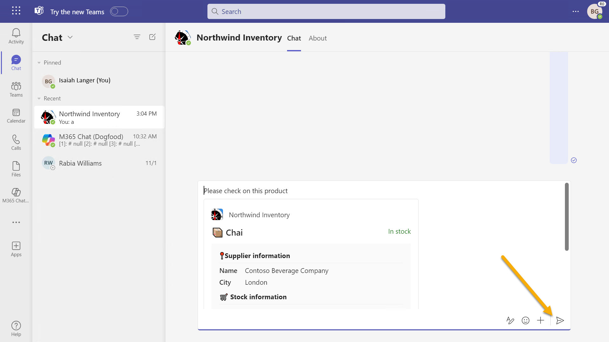
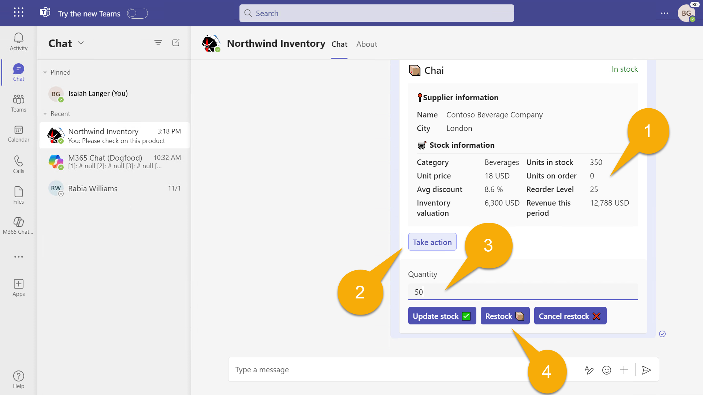

---
lab:
  title: Übung 1 - Führen Sie das Beispiel als Messaging-Erweiterung aus
  module: 'LAB 03: Build your own message extension plugin with TypeScript (TS) for Microsoft Copilot'
---

# Übung 1 - Führen Sie das Beispiel als Messaging-Erweiterung aus

In dieser Übung werden Sie die Anwendung als Plugin für Teams und Outlook ausführen. Sie experimentieren mit verschiedenen Eingabeaufforderungen und beobachten, wie das Plug-In mithilfe verschiedener Parameter aufgerufen wird.

## Aufgabe 1 - Einrichten des Projekts für die erste Verwendung

In diesem Projekt wird die Northwind-Datenbank in Azure Table Storage gespeichert; wenn Sie lokal debuggen, wird der [Azurite](https://learn.microsoft.com/azure/storage/common/storage-use-azurite?tabs=visual-studio)-Speicheremulator verwendet. Das ist größtenteils in das Projekt integriert, aber das Projekt wird nicht erstellt, wenn Sie nicht die Verbindungszeichenfolge angeben.

Das Teams Toolkit speichert Umgebungsvariablen im Ordner **env** und füllt alle Werte automatisch aus, wenn Sie Ihr Projekt zum ersten Mal starten. Es gibt jedoch einen Wert, der für die Beispielanwendung spezifisch ist, und zwar die Verbindungszeichenfolge für den Zugriff auf die Northwind-Datenbank. Die notwendigen Einstellungen werden in der Datei **env/.env.local.user.sample** vorgenommen. 

Erstellen Sie eine Kopie dieser Datei im Ordner **env** und nennen Sie sie **.env.local.user**. Hier werden geheime oder sensible Einstellungen gespeichert.

Wenn Sie nicht sicher sind, wie Sie dies in Visual Studio Code tun können: 

1. Erweitern Sie den Ordner **env** und klicken Sie mit der rechten Maustaste auf **.env.local.user.sample**. Wählen Sie **Kopieren** aus. 

1. Klicken Sie dann mit der rechten Maustaste auf eine beliebige Stelle im Ordner **env** und wählen Sie **Einfügen**. Sie haben eine neue Datei namens **".env.local.user copy.sample**". 

1. Benutzen Sie dasselbe Kontextmenü, um die Datei in **.env.local.user** umzubenennen, und Sie sind fertig.

    

Die resultierende **.env.local.user-Datei** sollte diese Zeile enthalten:

```console
SECRET_STORAGE_ACCOUNT_CONNECTION_STRING=UseDevelopmentStorage=true
```

## Aufgabe 2: Lokales Ausführen der App

1. Drücken Sie in Visual Studio Code bei geöffnetem **Arbeitsordner** die Taste **F5**, um das Debugging zu starten, oder wählen Sie die Schaltfläche Start 1️⃣.

1. Wählen Sie **Debuggen in Teams (Edge)** 2️⃣.

    

    Wenn Ihre Anwendung zum ersten Mal ausgeführt wird, werden Sie möglicherweise aufgefordert, NodeJS den Durchgang durch Ihre Firewall zu gestatten; dies ist notwendig, damit die Anwendung kommunizieren kann.

    Beim ersten Mal kann es eine Weile dauern, da alle npm-Pakete geladen werden müssen. Schließlich öffnet sich ein Browserfenster, in dem Sie aufgefordert werden, sich anzumelden.

    

    Sobald Sie angemeldet sind, sollte sich Microsoft Teams öffnen und ein Dialogfeld anzeigen, in dem die Installation Ihrer Anwendung angeboten wird. Beachten Sie die angezeigten Informationen, die aus dem **App-Manifest** stammen.

1. Wählen Sie **Hinzufügen**, um Northwind Inventory als persönliche Anwendung hinzuzufügen.

    

> [!NOTE]
> Wenn Sie diesen Bildschirm sehen, müssen Sie Ihre **env/.env.local.user**-Datei korrigieren; dies wird in der vorherigen Aufgabe erklärt.
>
> 

Sie sollten zu einem Chat innerhalb der Anwendung weitergeleitet werden, Sie können die Anwendung jedoch in jedem beliebigen Chat verwenden.

## Aufgabe 3 - Test in Microsoft Teams

1. Beginnen Sie im **Nordwind Inventory Chat** eine Nachricht 1️⃣ zu schreiben, die sich auf ein Produkt bezieht. Um eine adaptive Karte für das Produkt einzusetzen, wählen Sie **+** 2️⃣. 

1. Wählen Sie im Aufklappmenü die Anwendung **Northwind Bestand**, die Sie gerade installiert haben 3️⃣.

    

  Es wird ein Suchdialogfeld mit drei Registerkarten 1️⃣ angezeigt. Die Registerkarte **Produktbestand** ermöglicht die Suche nach Produkten nach Namen.

1. Geben Sie einen Produktnamen oder den Anfang eines Produktnamens wie **chai** in das Suchfeld 2️⃣ ein. Wenn Sie während der Eingabe der ersten Buchstaben anhalten, erhalten Sie mehr Auswahlmöglichkeiten für Produkte, die mit denselben Zeichen beginnen.

1. Wählen Sie **Chai** 3️⃣, um eine adaptive Karte zusammen mit Ihrem Kommentar in die Konversation einzufügen.

    

1. Sie können die Karte sehen, aber nicht benutzen, bevor Sie sie gesendet haben. Nehmen Sie letzte Änderungen an Ihrer Nachricht vor und wählen Sie **Senden**. Beachten Sie, dass es kein Chai in Auftrag gibt.1️⃣. Wir haben wohl ein paar häufige Chai-Trinker, und die könnten hier vorbeikommen, also bestellen Sie besser mehr! 

    

    > [!NOTE]
    > Adaptive Kartenaktionen funktionieren erst, wenn Sie die Karte senden. Wenn eine Fehlermeldung angezeigt wird, überprüfen Sie die Nachricht, und stellen Sie sicher, dass Sie die Nachricht gesendet haben und mit der Karte arbeiten, nachdem sie gesendet wurde.

1. Wählen Sie die Schaltfläche **Aktion ausführen** 2️⃣ aus, um eine untergeordnete Karte zu öffnen. Geben Sie eine Menge 3️⃣ ein, und wählen Sie die Schaltfläche**Neu auffüllen** 4️⃣ aus. Die Karte wird mit einer Erfolgsmeldung und einer aktualisierten Anzahl von Einheiten in Bestellung aktualisiert.

    

Mit den beiden anderen Schaltflächen können Sie die Bestellung stornieren oder die Lagerbestände ändern.

## Aufgabe 4 – Erweiterte Abfragen

Zurück in Visual Studio Code öffnen Sie die App-Manifestdatei namens **manifest.json** im Verzeichnis **appPackage**. Sie werden feststellen, dass sich die App-Informationen, die angezeigt wurden, als Sie die App installiert haben, alle hier befinden. Scrollen Sie nach unten, und suchen Sie `composeExtensions:`. 

```json
"composeExtensions": [
    {
        "botId": "${{BOT_ID}}",
        "commands": [
            {
                "id": "inventorySearch",
                ...
                "description": "Search products by name, category, inventory status, supplier location, stock level",
                "title": "Product inventory",
                "type": "query",
                "parameters": [ ... ]
            },
            {
                "id": "discountSearch",
                ...
                "description": "Search for discounted products by category",
                "title": "Discounts",
                "type": "query",
                "parameters": [ ...]
            }
        ]
    }
],
```

> [!NOTE]
> Erstellerweiterungen sind der historische Name für eine Messaging-Erweiterung; Die Northwind Inventory-Massaging-Erweiterung ist hier definiert.

Beachten Sie zunächst die von Microsoft Teams bereitgestellte **Bot-ID** , die den Azure-Bot-Kanal verwendet, um sichere Echtzeitnachrichten mit Ihrer Anwendung auszutauschen. Das Teams-Toolkit registriert den Bot und füllt die ID für Sie aus.

Beobachten Sie als Nächstes die Sammlung von Befehlen. Diese entsprechen den Registerkarten im Suchdialogfeld in Teams. In dieser Anwendung sind die Befehle in erster Linie für Copilot und nicht für normale Benutzerinnen und Benutzer gedacht!

Sie haben den ersten Befehl bereits ausgeführt, wenn Sie anhand des Namens nach einem Produkt gesucht haben. Wenn Sie die anderen Befehle ausprobieren möchten, geben Sie **Getränke**, **Milchprodukte** oder **Erzeugnisse** in die Registerkarte **Rabatte** ein, und Sie sehen die ermäßigten Produkte in diesen Kategorien. Copilot kann Ihre Abfrage verwenden, um Fragen zu ermäßigten Produkten zu beantworten.


Überprüfen Sie nun den ersten Befehl erneut. Sie werden feststellen, dass er fünf Parameter enthält!

```json
"parameters": [
    {
        "name": "productName",
        "title": "Product name",
        "description": "Enter a product name here",
        "inputType": "text"
    },
    {
        "name": "categoryName",
        "title": "Category name",
        "description": "Enter the category of the product",
        "inputType": "text"
    },
    {
        "name": "inventoryStatus",
        "title": "Inventory status",
        "description": "Enter what status of the product inventory. Possible values are 'in stock', 'low stock', 'on order', or 'out of stock'",
        "inputType": "text"
    },
    {
        "name": "supplierCity",
        "title": "Supplier city",
        "description": "Enter the supplier city of product",
        "inputType": "text"
    },
    {
        "name": "stockQuery",
        "title": "Stock level",
        "description": "Enter a range of integers such as 0-42 or 100- (for >100 items). Only use if you need an exact numeric range.",
        "inputType": "text"
    }
]
```

Teams kann zwar nur den ersten Parameter anzeigen; Copilot kann alle 5 verwenden, sodass die erweiterte Abfragen der Northwind-Inventardaten möglich ist. Als Problemumgehung für die Einschränkung der Teams-Benutzeroberfläche akzeptiert die Registerkarte **Northwind Inventory** bis zu 5 durch Kommas getrennte Parameter unter Verwendung des Formats:

```console
name,category,inventoryStatus,supplierCity,supplierName
```


Lesen Sie die Beschreibungen im obigen JSON sorgfältig, wenn Sie eine Abfrage eingeben. Versuchen Sie, die unten aufgeführten Begriffe einzugeben, und behalten Sie dabei die Registerkarte „Debugging-Konsole“ in Visual Studio Code im Auge, auf der jede Abfrage während der Ausführung angezeigt wird.

- **_Chai_** - Suchen Sie Produkte mit Namen, die mit **Chai** beginnen.

- **_c,bev_** - Suchen Sie Produkte in Kategorien, die mit **bev** beginnen, und Namen, die mit **c** beginnen.

- **_,,out,_** – Suchen Sie Produkte, die nicht mehr vorrätig sind.

- **_,,in,London_** – Suchen Sie Produkte, die von Lieferanten in London bestellt wurden.

- **_tofu,produce,,Osaka_** - Suchen Sie Produkte in der Kategorie **Erzeugnis** mit Lieferanten in **Osaka** und Namen, die mit **Tofu** beginnen.

Jeder Abfragebegriff filtert die Liste der Produkte nach unten. Das Format der einzelnen Abfragebegriffe ist beliebig - achten Sie nur darauf, dass Sie sie Copilot in der Beschreibung der einzelnen Parameter erklären.

## Aufgabe 5 – Testen in Microsoft Outlook

Lassen Sie uns einen kurzen Umweg unternehmen, damit Sie sehen können, wie Massaging-Erweiterungen in Microsoft Outlook funktionieren.

1. Öffnen Sie zuerst das Microsoft 365-App-Menü 1️⃣ und wählen Sie **Outlook** 2️⃣ aus.

    

1. Wählen Sie **Neue E-Mail** aus, um mit dem Verfassen einer E-Mail zu beginnen.

    

1. Fügen Sie einen **Empfänger** 1️⃣ und einen **Betreff** 2️⃣ hinzu, und positionieren Sie dann den Cursor im Textkörper der Nachricht 3️⃣. Sie können sogar etwas eingeben. Wenn Sie bereit sind, wählen Sie **Einfügen** aus der Symbolleiste und wählen Sie **Apps** in der Symbolleiste 4️⃣.

    

1. Wählen Sie die Anwendung **Northwind Inventory** aus, und suchen Sie gegebenenfalls, um sie zu finden.

    

1. Suchen Sie wie zuvor nach **Chai** 1️⃣, und wählen Sie das Ergebnis aus, um die adaptive Karte 2️⃣ einzufügen.

    

    

> [!NOTE]
> Die adaptive Karte funktioniert erst, wenn Sie die Nachricht senden. Der Empfänger kann die Karte nicht sehen, wenn er nicht Microsoft Outlook verwendet, und er kann auch keine Maßnahmen ergreifen, wenn er nicht selbst die Northwind Inventory-App installiert hat.

## Vorgang 6 – Northwind-Datenbank in Azure Storage-Explorer anzeigen

Die Northwind-Datenbank ist nicht ausgefallen, aber sie ist echt! Wenn Sie die Daten einsehen oder sogar ändern möchten:

1. Öffnen Sie den [Azure Storage Explorer](https://azure.microsoft.com/products/storage/storage-explorer/), während Azurite läuft (wenn Sie die App starten, wird Azurite automatisch gestartet).

1. Öffnen Sie **Emulator & Attached**, **Speicherkonten**, **Emulator - Standardanschlüsse** und **Tabellen**, um die Northwind-Daten anzuzeigen.

    

Der Code liest bei jeder Abfrage die Tabelle **Produkte**, aber auf die anderen Tabellen wird nur beim Start der App zugegriffen. Wenn Sie also eine neue Kategorie hinzufügen möchten, müssen Sie die App neu starten, damit sie erscheint.

## Arbeit überprüfen

Nachdem Sie alle Aufgaben in dieser Übung ausgeführt haben, sollten Sie eine funktionierende Messaging-Erweiterungs-Anwendung haben, die als Microsoft 365-Plugin für Teams oder Outlook verwendet werden kann.

Wenn alles funktioniert, sind Sie bereit, die Beispielanwendung in **Microsoft Copilot für Microsoft 365** auszuführen! 

[Fahren Sie mit der nächsten Übung fort...](./4-exercise-2-run-copilot-plugin.md)
