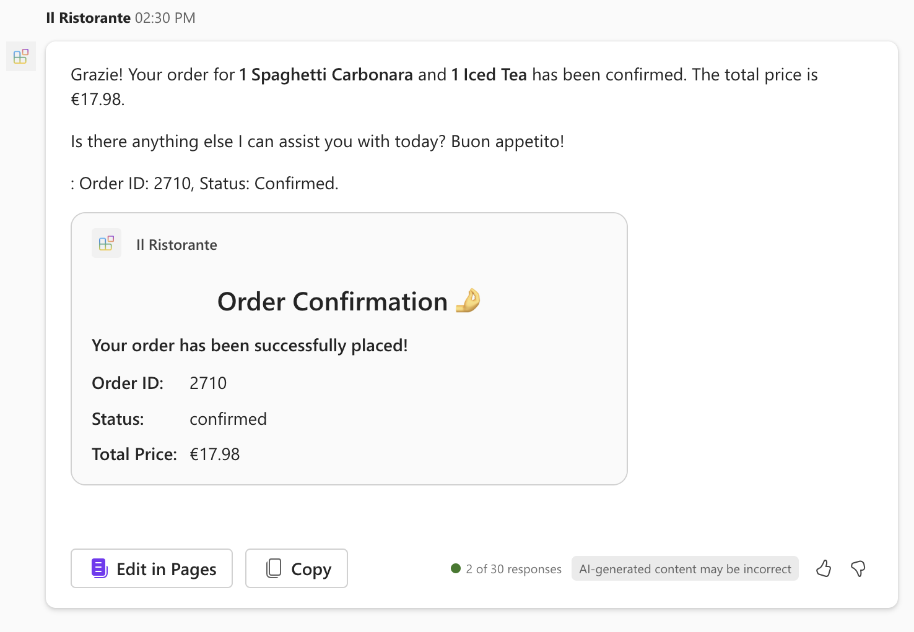

---
lab:
  title: Übung 3 – Testen des deklarativen Agenten mit dem API-Plug-In in Microsoft 365 Copilot
  module: 'LAB 03: Use Adaptive Cards to show data in API plugins for declarative agents'
---

# Übung 3 – Testen des deklarativen Agenten mit dem API-Plug-In in Microsoft 365 Copilot

Der letzte Schritt besteht darin, den deklarativen Agenten mit API-Plug-In in Microsoft 365 Copilot zu testen.

### Übungsdauer

- **Geschätzte Zeit bis zur Fertigstellung**: 10 Minuten

## Aufgabe 1 – Bereitstellen und Starten des Debuggens

In Visual Studio Code:

1. Wählen Sie in der **Aktivitätsleiste** **Teams Toolkit** aus.
1. Stellen Sie im Abschnitt **Konten** sicher, dass Sie bei Ihrem Microsoft 365 Mandanten mit Microsoft 365 Copilot angemeldet sind.

    

1. Wählen Sie in der **Aktivitätsleiste** die Option **Ausführen und Debuggen**.
1. Wählen Sie die Konfiguration **In Copilot debuggen** und starten Sie das Debugging über die Schaltfläche **Debugging starten**.  

    

1. Visual Studio Code erstellt und stellt Ihr Projekt in Ihrem Microsoft 365-Mandanten bereit und öffnet ein neues Webbrowserfenster.

## Übung 2 - Führen Sie den Test aus, und sehen Sie sich die Ergebnisse an

Im Webbrowser:

1. Melden Sie sich bei Aufforderung mit dem Konto an, das zu Ihrem Microsoft 365-Mandanten mit Microsoft 365 Copilot gehört.
1. Wählen Sie in der Seitenleiste **Il Ristorante**.

    

1. Wählen Sie den Gesprächsanlass **Was gibt es heute zu Mittag?** und übermitteln Sie den Prompt.

    

1. Wenn Sie dazu aufgefordert werden, prüfen Sie die Daten, die der Agent an die API sendet, und bestätigen Sie mit der Schaltfläche **Einmal zulassen**.

    

1. Warten Sie, bis der Agent reagiert. Beachten Sie, dass das Popup-Fenster bei einem Zitat jetzt Ihre benutzerdefinierte adaptive Karte mit zusätzlichen Informationen aus der API enthält.

    

1. Geben Sie eine Bestellung auf, indem Sie in das Prompt-Textfeld tippen: **1 x Spaghetti, 1 x Eistee** und senden Sie den Prompt ab.
1. Prüfen Sie die Daten, die der Agent an die API sendet und fahren Sie mit der Schaltfläche **Bestätigen** fort.

    

1. Warten Sie, bis der Agent die Bestellung abgibt, und geben Sie die Bestellzusammenfassung zurück. Beachten Sie, dass der Agent die Antwort der API, die ein einzelnes Element zurückgibt, mithilfe einer adaptiven Karte darstellt und die Karte direkt in seine Antwort einfügt.

    

1. Wechseln Sie zurück zu Visual Studio Code und beenden Sie das Debuggen.
1. Wechseln Sie auf die Registerkarte **Terminal** und schließen Sie alle aktiven Terminals.

    
