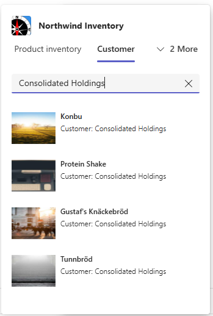

---
lab:
  title: Übung 3 – Hinzufügen eines neuen Befehls
  module: 'LAB 03: Build your own message extension plugin with TypeScript (TS) for Microsoft Copilot'
---

# Übung 3 – Hinzufügen eines neuen Befehls

In dieser Übung werden Sie die Teams Messaging-Erweiterung und das Copilot-Plug-In, um einen neuen Befehl erweitern. Die derzeitige Messaging-Erweiterung liefert zwar Informationen über die Produkte in der Northwind-Bestandsdatenbank, aber keine Informationen über die Kundschaft von Northwind. Sie werden einen neuen Befehl einführen, der mit einem API-Aufruf verbunden ist und Produkte abruft, die nach einem vom Benutzenden angegebenen Kundennamen bestellt wurden. Diese Übung setzt voraus, dass Sie mindestens die Übungen 1, 2 und 3 abgeschlossen haben. Sie können Übung 4 überspringen, wenn Sie keine Copilot für Microsoft 365-Lizenz haben.

Um dies zu erreichen, gehen wir die folgenden Aufgaben durch:

1. **Erweitern Sie die Benutzeroberfläche Messaging-Erweiterung / Plug-In**, indem Sie das Teams Ap-Manifest ändern. Dazu gehört die Einführung eines neuen Befehls: **"companySearch"**. Beachten Sie, dass die Benutzeroberfläche für die Messaging-Erweiterung eine adaptive Karte ist, während es sich bei Copilot um eine Texteingabe und -ausgabe im Copilot-Chat handelt.

1. **Erstellen Sie einen Handler für den Befehl 'companySearch'**. Dadurch wird die vom Nachrichten-Routing-Code geparste Abfragezeichenfolge  analysiert, die Eingabe validiert und die API für die Produktsuche nach Unternehmen aufgerufen. Diese Aufgabe füllt auch eine adaptive Karte mit der zurückgegebenen Produktliste, die in der Nachricht oder der Copilot-Chat-Benutzeroberfläche angezeigt wird.

1. Aktualisieren Sie den Code für das **Routing** des Befehls, um den neuen Befehl an den in der vorherigen Aufgabe erstellten Handler weiterzuleiten. Dazu wird die Methode erweitert, die vom Bot Framework aufgerufen wird, wenn Benutzende die Northwind-Datenbank abfragen (**handleTeamsMessagingExtensionQuery**). 

1. **Implementieren Sie eine Produktsuche nach Unternehmen**, die eine Liste der von diesem Unternehmen bestellten Produkte liefert.

1. **Führen Sie die App aus** und suchen Sie nach Produkten, die von einem bestimmten Unternehmen gekauft wurden.

## Aufgabe 1 – Erweitern der Messaging-Erweiterung /Plug-In-Benutzeroberfläche 

1. Öffnen Sie in Visual Studio Code aus dem **Arbeitsordner** die Datei **manifest.json** und fügen Sie unmittelbar nach dem Befehl `discountSearch` die folgende json-Datei ein. Mit diesen zusätzlichen Informationen fügen Sie dem `commands`-Array hinzu, das die Liste der vom Plugin unterstützten Befehle definiert.

   ```json
   {
       "id": "companySearch",
       "context": [
           "compose",
           "commandBox"
       ],
       "description": "Given a company name, search for products ordered by that company",
       "title": "Customer",
       "type": "query",
       "parameters": [
           {
               "name": "companyName",
               "title": "Company name",
               "description": "The company name to find products ordered by that company",
               "inputType": "text"
           }
       ]
   }
   ```

> [!NOTE] 
> Die **ID** ist die Verbindung zwischen der Benutzeroberfläche und dem Code. Dieser Wert ist als **COMMAND_ID** in den **discount/product/SearchCommand.ts**-Dateien definiert. Sehen Sie, dass jede dieser Dateien eine eindeutige **COMMAND_ID** hat, die dem Wert von **ID** entspricht.

## Aufgabe 2 - Erstellen Sie einen Handler für den Befehl 'companySearch'. 

In dieser Übung werden wir einen Teil des vorhandenen Codes kopieren, um neue Handler für unsere Befehle zu erstellen. 

1. Kopieren Sie in Visual Studio Code die Datei "**productSearchCommand.ts**" und fügen Sie sie in denselben Ordner ein, um eine Kopie zu erstellen. Benennen Sie diese Datei in **customerSearchCommand.ts**um

1. Zeile 10 ändern in:

   ```javascript
   const COMMAND_ID = "companySearch";
   ```

1. Ersetzen Sie den Inhalt von **handleTeamsMessagingExtensionQuery** durch:

   ```javascript
    {
       let companyName;
   
       // Validate the incoming query, making sure it's the 'companySearch' command
       // The value of the 'companyName' parameter is the company name to search for
       if (query.parameters.length === 1 && query.parameters[0]?.name === "companyName") {
           [companyName] = (query.parameters[0]?.value.split(','));
       } else { 
           companyName = cleanupParam(query.parameters.find((element) => element.name === "companyName")?.value);
       }
       console.log(`🍽️ Query #${++queryCount}:\ncompanyName=${companyName}`);    
   
       const products = await searchProductsByCustomer(companyName);
   
       console.log(`Found ${products.length} products in the Northwind database`)
       const attachments = [];
       products.forEach((product) => {
           const preview = CardFactory.heroCard(product.ProductName,
               `Customer: ${companyName}`, [product.ImageUrl]);
   
           const resultCard = cardHandler.getEditCard(product);
           const attachment = { ...resultCard, preview };
           attachments.push(attachment);
       });
       return {
           composeExtension: {
               type: "result",
               attachmentLayout: "list",
               attachments: attachments,
           },
       };
   }
   ```

> [!NOTE]
> Sie werden `searchProductsByCustomer` in Aufgabe 4 implementieren.

## Aufgabe 3 – Aktualisieren des Befehlsroutings

In dieser Aufgabe leiten Sie den Befehl `companySearch` an den Handler weiter, den Sie in der vorherigen Aufgabe implementiert haben.

1. Öffnen Sie **searchApp.ts** und fügen Sie Folgendes hinzu. Unter dieser Zeile:

   ```javascript
   import discountedSearchCommand from "./messageExtensions/discountSearchCommand";
   ```

1. Fügen Sie die Zeile  hinzu:

   ```javascript
   import customerSearchCommand from "./messageExtensions/customerSearchCommand";
   ```

1. Unter dieser Anweisung:

   ```javascript
         case discountedSearchCommand.COMMAND_ID: {
           return discountedSearchCommand.handleTeamsMessagingExtensionQuery(context, query);
         }
   ```

1. Fügen Sie diese Anweisung hinzu:

   ```javascript
         case customerSearchCommand.COMMAND_ID: {
           return customerSearchCommand.handleTeamsMessagingExtensionQuery(context, query);
         }
   ```

> [!NOTE]
> Der UI-basierte Vorgang des Plug-Ins wird explizit aufgerufen. Wenn er jedoch von Microsoft 365 Copilot aufgerufen wird, wird der Befehl vom Copilot-Orchestrator ausgelöst.

## Aufgabe 4 – Implementieren der Produktsuche nach Unternehmen

In dieser Aufgabe werden Sie eine Produktsuche **nach Firmenname** implementieren und eine Liste der bestellten Produkte der Firma zurückgeben. Die Tabellenausgabe aus der Abfrage sieht wie folgt aus:

| Tabelle         | Suchen        | Nachschlagen nach    |
| ------------- | ----------- | ------------- |
| Kreditor      | Kundenkennung | Kundenname |
| Aufträge        | Auftrags-ID    | Kundenkennung   |
| OrderDetail   | Produkt     | Auftrags-ID      |

Informationen zum Ablauf einer Abfrage: 

1. Verwenden Sie die Tabelle** Kunde**, um die **Kunden-ID** mit dem **Kundennamen** zu finden. 

1. Fragen Sie die Tabelle **Bestellungen** mit der **Kunden-ID** ab, um die zugeordneten **** Auftrags-IDs abzurufen. 

1. Suchen Sie für jede **Auftrags-ID** die zugehörigen Produkte in der Tabelle **Bestellungsdetails**. 

1. Schließlich wird eine Liste von Produkten zurückgegeben, die nach dem angegebenen Firmennamen geordnet sind.

Ändern wir nun die Datei **products.ts**, um die neue Suchabfrage hinzuzufügen.

1. Öffnen Sie **.\src\northwindDB\products.ts**

1. Aktualisieren Sie die `import`-Anweisung in Zeile 1, um OrderDetail, Order und Customer aufzunehmen. Sie sollte wie folgt aussehen:

   ```javascript
   import {
       TABLE_NAME, Product, ProductEx, Supplier, Category, OrderDetail,
       Order, Customer
   } from './model';
   ```

1. Fügen Sie die neue `searchProductsByCustomer()`-Funktion hinzu

   Unter dieser Zeile:

   ```javascript
   import { getInventoryStatus } from '../adaptiveCards/utils';
   ```

   Fügen Sie die -Funktion hinzu:

   ```javascript
   export async function searchProductsByCustomer(companyName: string): Promise<ProductEx[]> {

       let result = await getAllProductsEx();
   
       let customers = await loadReferenceData<Customer>(TABLE_NAME.CUSTOMER);
       let customerId="";
       for (const c in customers) {
           if (customers[c].CompanyName.toLowerCase().includes(companyName.toLowerCase())) {
               customerId = customers[c].CustomerID;
               break;
           }
       }
       
       if (customerId === "") 
           return [];

       let orders = await loadReferenceData<Order>(TABLE_NAME.ORDER);
       let orderdetails = await loadReferenceData<OrderDetail>(TABLE_NAME.ORDER_DETAIL);
       // build an array orders by customer id
       let customerOrders = [];
       for (const o in orders) {
           if (customerId === orders[o].CustomerID) {
               customerOrders.push(orders[o]);
           }
       }
       
       let customerOrdersDetails = [];
       // build an array order details customerOrders array
       for (const od in orderdetails) {
           for (const co in customerOrders) {
               if (customerOrders[co].OrderID === orderdetails[od].OrderID) {
                   customerOrdersDetails.push(orderdetails[od]);
               }
           }
       }

       // Filter products by the ProductID in the customerOrdersDetails array
       result = result.filter(product => 
           customerOrdersDetails.some(order => order.ProductID === product.ProductID)
       );

       return result;
   }
   ```

## Aufgabe 5 - Führen Sie die App aus! Suchen nach Produkt nach Firmenname

Jetzt können Sie das Beispiel als Plug-In für Copilot für Microsoft 365 testen.

1. Entfernen Sie die App **Nordwest-Inventory** in Teams. Diese Aufgabe ist erforderlich, da Sie das Manifest aktualisieren. Für Manifestupdates muss die App neu installiert werden. Der sauberste Weg, dies zu tun, ist, sie zunächst aus den Teams zu entfernen.

    1. Wählen Sie in der Teams-Randleiste die drei Punkte (...) 1️⃣ aus. In der Liste der Anwendungen sollte Northwind Inventory** 2️⃣ angezeigt **werden.

    1. Klicken Sie mit der rechten Maustaste auf das Symbol **Northwest Inventory** und wählen Sie deinstallieren 3️⃣.

        

1. Starten Sie die App in Visual Studio Code mit dem Profil **Debug in Teams (Edge)** durch Drücken von **F5**.

1. Wählen Sie in Teams **Chat** und dann **Copilot**. Copilot sollte die beste Option sein.

1. Wählen Sie das **Plug-In-Symbol** und dann **Northwind Inventory** aus, um das Plug-In zu aktivieren.

1. Geben Sie die Eingabeaufforderung  ein. 

   ```console
   What are the products ordered by 'Consolidated Holdings' in Northwind Inventory?
   ```

   Die Terminalausgabe zeigt, dass Copilot die Abfrage verstanden und den `companySearch` Befehl ausgeführt hat, wobei der Von Copilot extrahierte Firmenname übergeben wird.

   

   Dies ist die Ausgabe in Copilot:

    

Hier sind weitere Aufforderungen zum Ausprobieren:

```console
What are the products ordered by 'Consolidated Holdings' in Northwind Inventory? Please list the product name, price and supplier in a table.
```

Natürlich können Sie diesen neuen Befehl auch testen, indem Sie das Beispiel als Nachrichtenerweiterung verwenden, wie wir es in der vorherigen Übung getan haben. 

1. Gehen Sie in der Randleiste von Teams zum Abschnitt **Chats** und wählen Sie einen beliebigen Chat aus oder beginnen Sie einen neuen Chat mit dem Kollegium.

1. Wählen Sie das **+** Zeichen aus, um auf das Menü Apps zuzugreifen.

1. Wähle die **Nordwind Inventory** App.

1. Beachten Sie, wie jetzt eine neue Registerkarte namens **Kunde** angezeigt wird.

1. Suchen Sie nach **Konsolidierten Beteiligungen** , und sehen Sie sich die von diesem Unternehmen bestellten Produkte an. Sie stimmen mit denen überein, die Copilot Sie in der vorherigen Aufgabe zurückgegeben hat.

    

## Arbeit überprüfen

Nach Abschluss der Übung sollten Sie über einen neuen Befehl verfügen, um in der Northwind Inventory-App nach Bestellungen nach Unternehmen zu suchen. Sie sollten auch in der Lage sein, das Plug-In mit Copilot und als Messaging-Eweiterung in anderen Apps erfolgreich zu verwenden. 

In der nächsten Übung werden Sie den Plug-In-Quellcode und adaptive Karten erkunden, um mehr darüber zu erfahren, wie die Apps erstellt werden und wie Sie sie weiter anpassen können.

[Fahren Sie mit der nächsten Übung fort...](./6-exercise-4-explore-plugin-source-code.md)