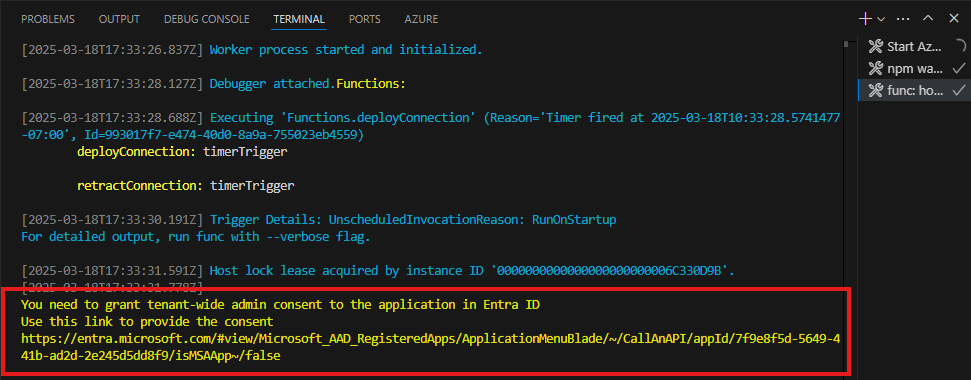

---
lab:
  title: 'Übung 1: Erstellen einer externen Verbindung für den Graph-Connector'
  module: 'LAB 04: Add custom knowledge to declarative agents using Microsoft Graph connectors and Visual Studio Code'
---

# Übung 1: Erstellen einer externen Verbindung für den Graph-Connector

Durch das Erweitern eines deklarativen Agents mit Wissen erhalten Sie Zugriff auf zusätzliche Informationen, die nicht Teil des großen Sprachmodells sind. Mithilfe von Graph-Connectors können Sie externe Daten in Microsoft 365 aufnehmen, wo sie für verschiedene Benutzererfahrungen verfügbar sind, einschließlich Microsoft 365 Copilot. Bei der Konfiguration der Wissenseinstellungen eines Copilot-Agents können Sie diesen über einen Graph Connector mit einer externen Verbindung integrieren.

### Übungsdauer

- **Geschätzte Zeit bis zur Fertigstellung**: 10 Minuten

## Aufgabe 1: Herunterladen eines Beispielprojekts und Verbinden mit Ressourcen

Wenn Sie einen Copilot-Agent mit einem Graph-Connector integrieren, müssen Sie die ID der externen Verbindung angeben, die der Connector erstellt hat. In der Regel stellen Sie Graph-Connectors separat von Copilot-Agents bereit. Um diese Übung abzuschließen, stellen Sie einen vorhandenen Graph-Connector bereit, auf den Sie in späteren Schritten verweisen.

Beginnen Sie mit dem Herunterladen des Beispielprojekts für den Graph-Connector.

1. Navigieren Sie hierzu in einem Webbrowser zu [https://aka.ms/learn-gc-ts-policies](https://aka.ms/learn-gc-ts-policies). Sie erhalten eine Aufforderung zum Herunterladen einer ZIP-Datei mit dem Beispielprojekt.
1. Speichern Sie die ZIP-Datei auf Ihrem Computer.
    1. Erstellen Sie einen neuen Ordner in **Dokumente**.
    1. Entpacken Sie den Inhalt der heruntergeladenen ZIP-Datei in den soeben erstellten Ordner.
    1. Öffnen Sie in Visual Studio Code den Ordner .

In Visual Studio Code:

1. Wählen Sie im Menü „Datei“ die Option **Ordner öffnen …**.
1. Öffnen Sie den Projektordner, den Sie gerade in Ihren **Dokumente-Ordner** extrahiert haben.
1. Öffnen Sie in der **Aktivitätsleiste** (Seitenleiste) die Erweiterung **Teams-Toolkit**.
1. Bestätigen Sie im Bereich **Konten**, dass Sie mit Ihrem **Microsoft 365-Mandanten** verbunden sind.
1. Bestätigen Sie im Bereich **Konten**, dass Sie mit Ihrem **Azure-Abonnement** verbunden sind.

    

> [!NOTE]
> Wenn Sie keine vollständige Microsoft 365 Copilot-Lizenz besitzen, wird möglicherweise „Copilot-Zugriff deaktiviert“ angezeigt. Die Übungen können weiterhin abgeschlossen werden, obwohl Sie möglicherweise nicht in der Lage sind, den Agent im Microsoft 365 Copilot-Chat vollständig zu testen.

## Aufgabe 2: Ausführen des Projekts und Erstellen einer Verbindung mit Microsoft 365

1. Starten Sie das Projekt, indem Sie <kbd>F5</kbd> drücken. Das Teams-Toolkit erstellt eine neue Microsoft Entra-App-Registrierung in Ihrem Mandanten, mit der der Graph-Connector mit Ihrem Microsoft 365-Mandanten kommunizieren kann. Das Teams-Toolkit startet auch die zeitgesteuerte Azure-Funktion, die den Graph-Connector hostet.

> [!IMPORTANT]
> Dieser Schritt kann bis zu 10 Minuten oder mehr dauern, bis Sie die Übung abgeschlossen haben.

1. Bevor der Graph-Connector ausgeführt werden kann, müssen Sie den Berechtigungen zustimmen, die die Entra-App benötigt. Um die Einwilligung zu erteilen, befolgen Sie die Anweisungen im Bereich **Terminal** der Aufgabe **func: host start**.

    

1. Öffnen Sie die Einwilligungs-URL in einem Webbrowser. Melden Sie sich mit Ihrem Arbeitskonto an, das zu Ihrem Microsoft 365-Mandanten gehört. Erteilen Sie der App die erforderlichen Berechtigungen über die Schaltfläche **Admin-Zustimmung erteilen**.

    

1. Nachdem Sie die Zustimmung zu den erforderlichen Berechtigungen erteilt haben, wird der Graph-Connector fortgesetzt. Beachten Sie im **Terminalbereich** die Ausgabe des Graph-Connectors. Der Graph-Connector erstellt eine externe Verbindung, stellt das Schema bereit und nimmt den Beispielinhalt in Ihren Microsoft 365-Mandanten auf.
1. Die Ausführung des Connectors dauert 5 bis 10 Minuten. Wenn der Vorgang abgeschlossen ist, beenden Sie das Debuggen, indem Sie in der Debug-Symbolleiste auf die Schaltfläche **Beenden** klicken.

    
