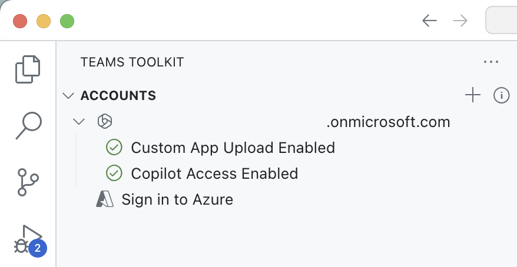

---
lab:
  title: 'Übung 4: Testen des deklarativen Agents mit API-Plug-In in Microsoft 365 Copilot Chat'
  module: 'LAB 05: Authenticate your API plugin for declarative agents with secured APIs'
---

# Übung 4: Testen des deklarativen Agents in Microsoft 365 Copilot

In dieser Übung testen und implementieren Sie Ihren deklarativen Agents in Microsoft 365 und testen ihn mit Microsoft 365 Copilot Chat.

### Übungsdauer

- **Geschätzter Zeitaufwand**: 5 Minuten

## Aufgabe 1: Testen des deklarativen Agents mit dem API-Plug-In in Microsoft 365 Copilot

Der letzte Schritt besteht darin, den deklarativen Agent mit API-Plug-In in Microsoft 365 Copilot zu testen.

In Visual Studio Code:

1. Aktivieren Sie in der Aktivitätsleiste die Erweiterung **Teams Toolkit**.
1. Vergewissern Sie sich im Bedienfeld **Teams Toolkit** im Abschnitt **Konten**, dass Sie bei Ihrem Microsoft 365 Mandanten angemeldet sind.

    

1. Wechseln Sie in der Aktivitätsleiste zur Ansicht **Ausführen und Debuggen**.
1. Wählen Sie aus der Liste der Konfigurationen **Debuggen in Copilot (Edge)** und drücken Sie die Wiedergabetaste, um das Debuggen zu starten.

    

    Visual Studio Code öffnet einen neuen Webbrowser mit Microsoft 365 Copilot. Wenn Sie dazu aufgefordert werden, melden Sie sich mit Ihrem Microsoft 365-Konto an.

Im Webbrowser:

1. Wählen Sie im Bedienfeld den Agents **da-repairs-oauthlocal** aus.

    

1. Geben Sie in das Prompt-Textfeld `Show repair records assigned to Karin Blair` ein und übermitteln Sie den Prompt.

    > [!TIP]
    > Anstatt den Prompt einzugeben, können Sie ihn aus den Konversationsstartern auswählen.

    

1. Bestätigen Sie, dass Sie Daten an das API-Plug-In senden möchten, indem Sie auf die Schaltfläche **Immer zulassen** klicken.

    

1. Melden Sie sich bei der entsprechenden Aufforderung bei der API an, um mit demselben Konto fortzufahren, das Sie für die Anmeldung bei Ihrem Microsoft 365-Mandanten verwenden, indem Sie **Bei da-repairs-oauthlocal anmelden** auswählen.

    

1. Warten Sie, bis der Agent reagiert.

    

Obwohl auf Ihre API anonym zugegriffen werden kann, da sie auf Ihrem lokalen Computer ausgeführt wird, ruft Microsoft 365 Copilot Ihre API authentifiziert gemäß der API-Spezifikation auf. Sie können überprüfen, ob die Anforderung ein Zugriffstoken enthält, indem Sie einen Haltepunkt in der **Reparaturfunktion** festlegen und einen weiteren Prompt an den deklarativen Agenten übermitteln. Wenn der Code Ihren Haltepunkt erreicht, erweitern Sie die Sammlung „req.headers“ und suchen Sie nach dem Autorisierungsheader, der ein JSON-Webtoken (JWT) enthält.

Beenden Sie die Debugsitzung in Visual Studio Code, wenn Sie mit dem Testen fertig sind.
